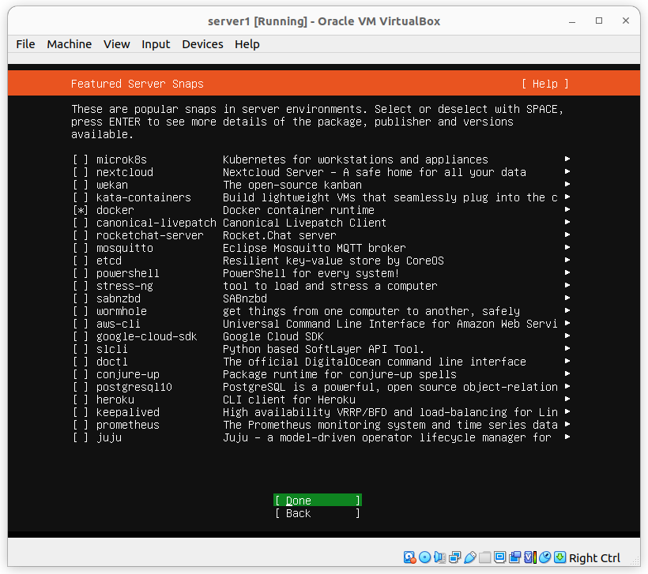

# 1.NAT Dan Instal Docker

Sebelum dualboot, saya pake windows dalam menjalankan servernya, Kemudian saya install dualboot linux ubuntu 22.04, dan Virtual Machinenya saya pake Virtual Box

Berikut Bukti saya sudah bisa menjalankan Nat 


Berikut Bukti saya sudah bisa menjalankan Nat 



# 2. Menjalankan Aplikasi Python


cat : saya masih blum bisa menggunakan server, diatas berjalan baru dari lokal saja

### langkah nya :

1.Buat File Khusus untuk mencoba python

```
mkdir coba_python-env
```

2.Buat file py nya,

```
sudo nano app.py
```

masukan script didalamnya

```
from flask import Flask

app = flask(__name__)

@app.route("/")
def hello_world():
  return "<p>Hello, World!</p>"
```

2. install python3

3. install pip 

```
sudo apt install python3-pip
```

4. install virtualenv

```
pip install virtualenv
```

5. install flask

```
pip install flask
```

6.Jalankan :

install dulu flasknya:

```
sudo apt install python3-flask
```

kemudian jalankan dengan :

```
flask run
```
