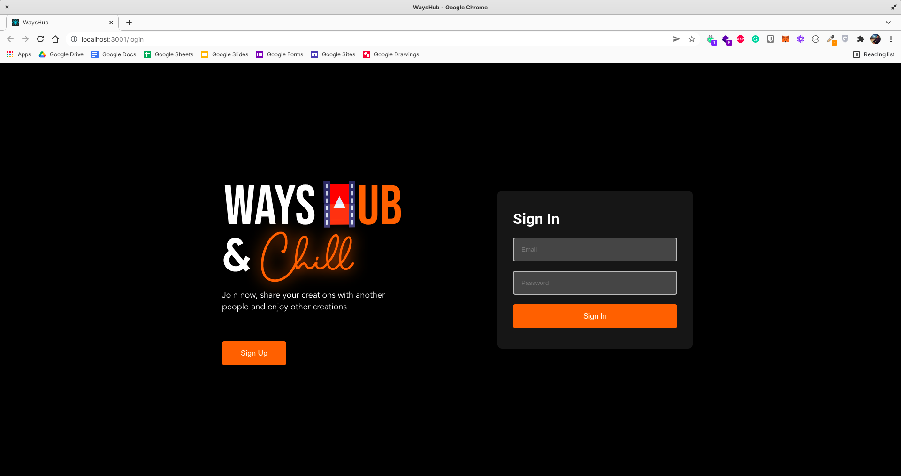

# Task

# Instruksi

CAUTION
Pastikan untuk melakukan screenshot step by step yang dilakukan, untuk digunakan sebagai dokumentasi tugas.

Setelah mempelajari terkait CI/CD serta melakukan konfigurasi CI/CD menggunakan Cloudflare Pages, maka silakan jalankan aplikasi dengan ketentuan sebagai berikut:

# Kententuan

Fork repository berikut ke akun GitHub Anda https://github.com/dumbwaysdev/wayshub-frontend
Deploy aplikasi yang sudah disediakan menggunakan Cloudflare Pages
Kemudian lakukan perubahan pada file /public/index.html bagian <title>WaysHub</title> menjadi <title>WaysHub - Nama Anda</title>
Pasikan CI/CD berjalan dengan baik hingga aplikasi dapat di akses

# Pengumpulan

Pastikan untuk mengerjakan tugas mingguan pada medium.com.
Tulis step-by-step yang telah Anda lakukan secara detail dan sertakan screenshot setiap prosesnya.
Setelah menyelesaikan tugas, silakan publish artikel yang sudah dibuat.

#Project Management

Tambahkan deskripsi berikut ke dalam kanban pada project management Anda

Melakukan konfigurasi CI/CD menggunakan Cloudflare Pages.

- [ ] Definisikan apa itu Cloudflare Pages menurut pemahamanmu
- [ ] Fork repository berikut ke akun GitHub Anda https://github.com/dumbwaysdev/wayshub-frontend
- [ ] Deploy aplikasi yang sudah difork menggunakan Cloudflare Pages
- [ ] Lakukan perubahan pada file `/public/index.html` bagian `<title>WaysHub</title>` menjadi `<title>WaysHub - Nama Anda</title>`
- [ ] Push perubahan tersebut ke repository aplikasi Anda
- [ ] Pasikan CI/CD berjalan dengan baik hingga perubahan pada aplikasi terjadi secara otomatis

# Diskusi
Silakan diskusikan terkait kendala atau kesulitan selama pembelajaran pada platform diskusi (slack/talk.ink) dengan membuat thread, misalnya "Introduction DevOps: problem cannot connect to network in VMware"

link yang dikasih selama meet

1.Sumber Apk
https://github.com/dumbwaysdev/dumbflix-frontend

2.Contoh Tugas
https://batch12-cicd.pages.dev/
