# Task 5

# Konfigurasi CI/CD Menggunakan Cloudflare

## Sebelumnya Apa itu Cloudflare? 

Cloudflare adalah suite keamanan dan kinerja terintegrasi untuk aplikasi berbasis web. Layanan ini Cloudflare mencoba menghilangkan masalah umum dalam jaringan internet yakni latensi dan keamanan data. Dibuat pada tahun 2007 oleh Matthew Prince, Lee Holloway dan Michelle Zatlyn, Cloudflare bertujuan menawarkan layanan keamanan ke situs web.

Cloudflare ini Mempunyai fitur CI/CD didalamnya, dimana kita bisa memanfaatkannya Untuk Konfigurasi Aplikasi Kita.

# Step 1 -Fork aplikasi 

1.Kita langsung klik link ini https://github.com/dumbwaysdev/wayshub-frontend

2. setelah kita masuk ke githubnya, kita klik saja lambang fork disebelah kanan atas 
 
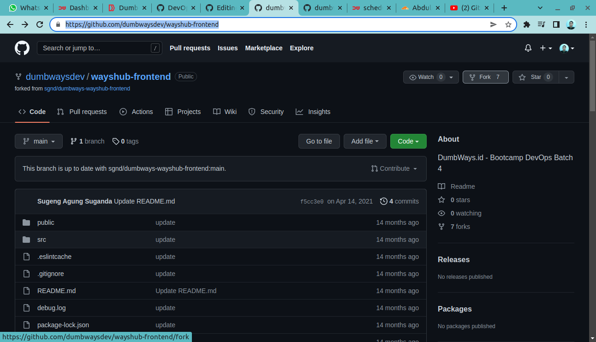

3.Dikarenakan Saya sudah melakukan fork sebelumnya, maka otomatis langsung muncul keterngannya seperti ini:

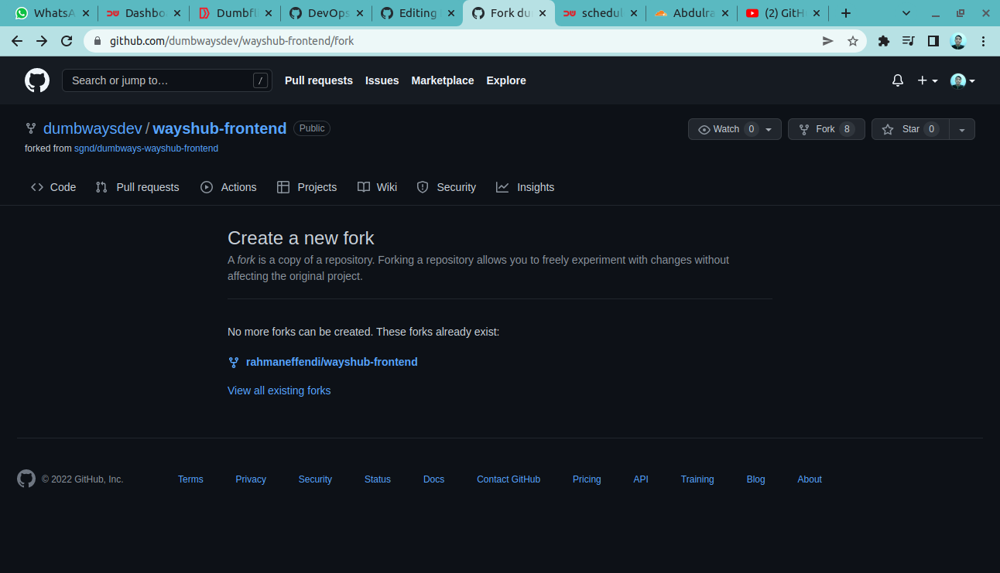

dari gambar diatas, kita bisa tau kalau kita sudah berhasil melakukan `fork` terhadap repository tersebut

# Step 2 -Buat Akun Cloudflare 

Sign Up Akun Cloudflare terlebih dahaulu dengan mengisi Semua data di https://dash.cloudflare.com/sign-up

# Step 3 -Konfigurasi Dan Deployment

1. Login pada akun cloudflare, kemudian masuk ke `pages` dibagian kiri website, kemudian klik `create a project` 

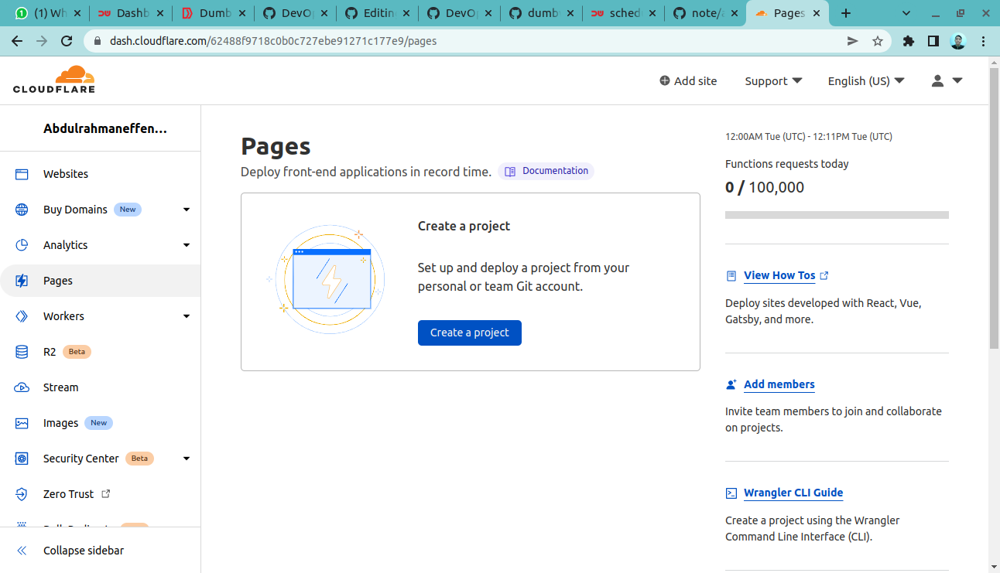

2.Hubungkan Cloudflare kita dengan Github dengan klik `Connect Github`

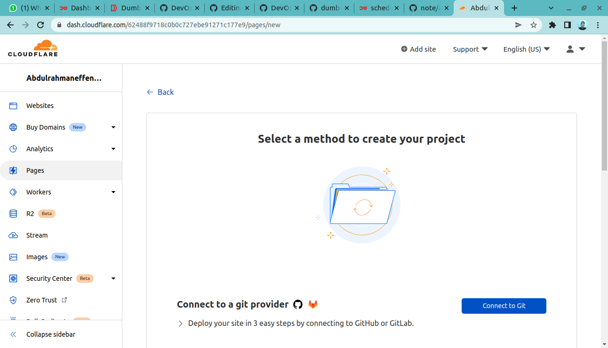

3.kita klik all repository 

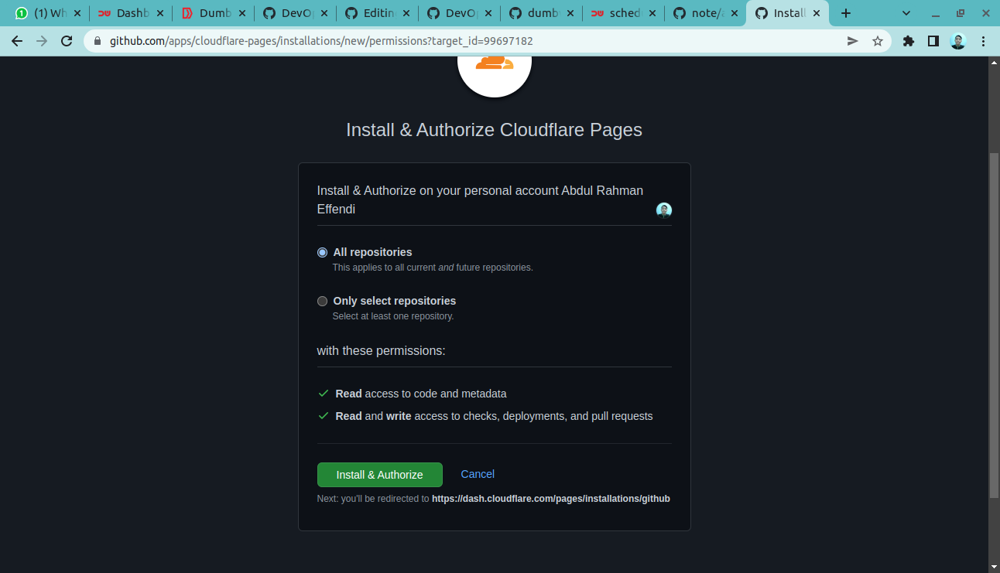

4.Jika sudah terhubung dengan github, Kemudian kita pilih repository yang sudah kita fork di step satu, yaitu repository `wayshub-frontend`

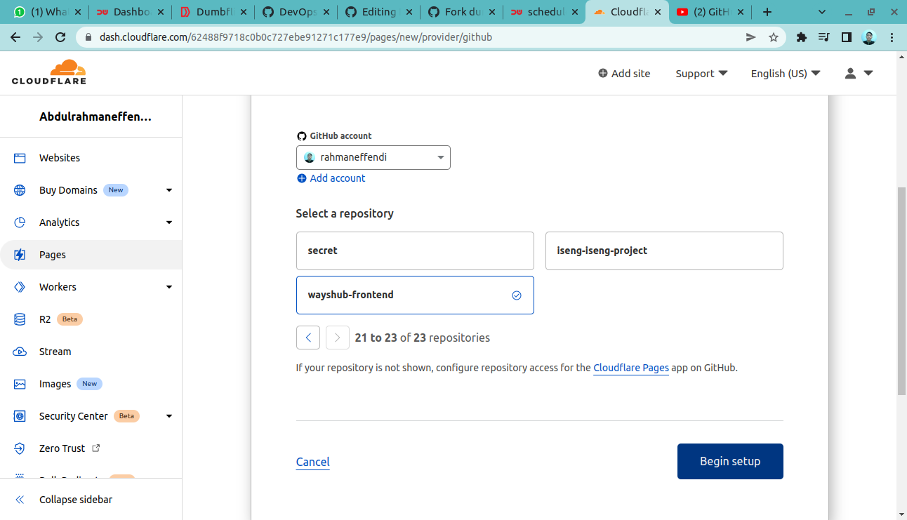

dari situ kita langsung klik `begin setup`

5.dari sini kita masukan nama project dan branch nya :

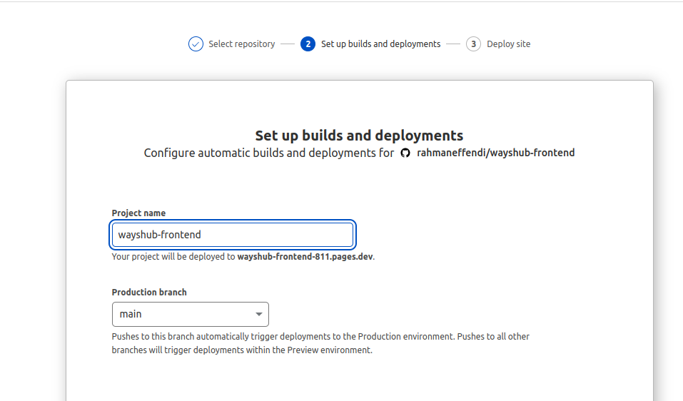

Disini kita akan konfigurasi build nya, pilih framework yang kalian gunakan di repository yang sudah kalian pilih tadi, disini saya menggunakan React maka saya memilih Create React App, kemudian di "Build Command" akan terganti sesuai rekomendasi framework yang kita pilih tadi, dan untuk build biarkan default rekomendasi

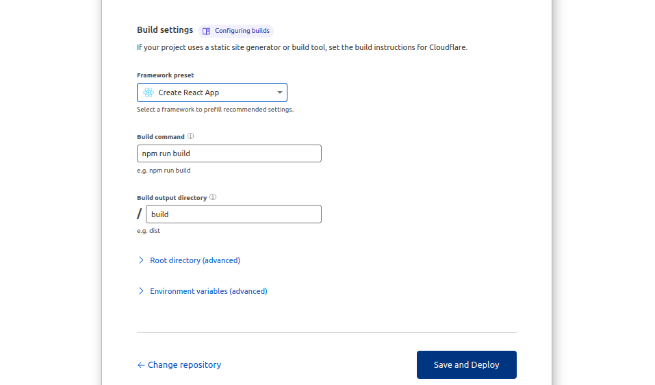

Pada bagian ini Root directory saya sudah benar berada di "/" dan Untuk "Environment variables" saya kosongkan karena tidak ada backend didalam project ini hanya front end saja

6.kita tunggu saja sampai deploy nya selesai

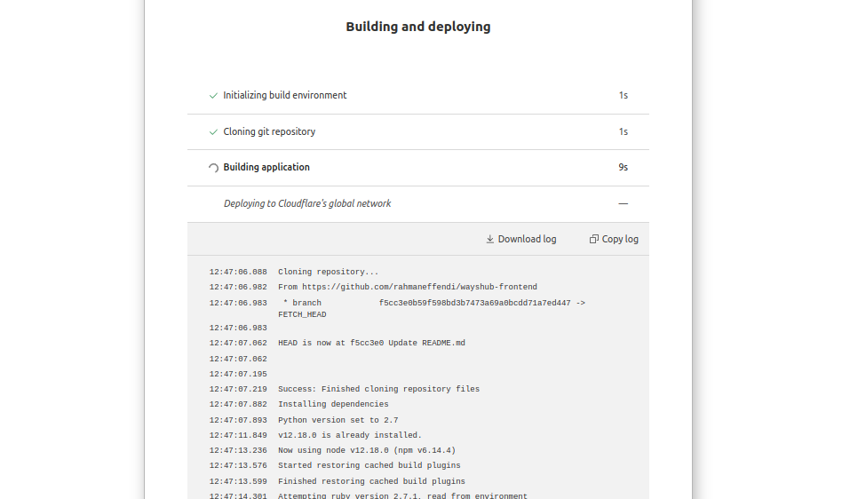

7.Jika proses build dan deploy berhasil maka akan muncul gambar berikut dan kita akan copy link yang telah diberikan untuk di tes

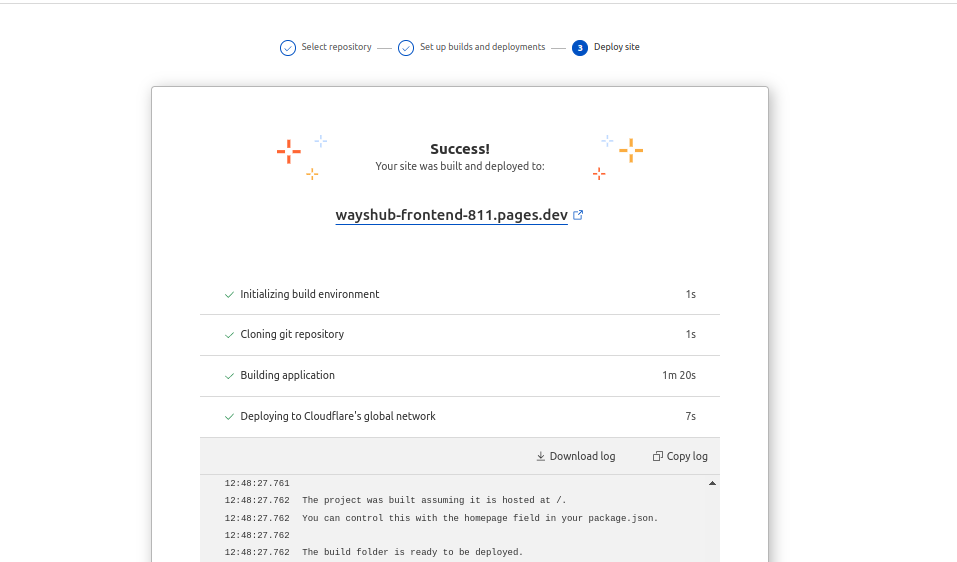

8.Dan setelah di tes proses deploy berhasil, web dapat diakses dengan sempurna

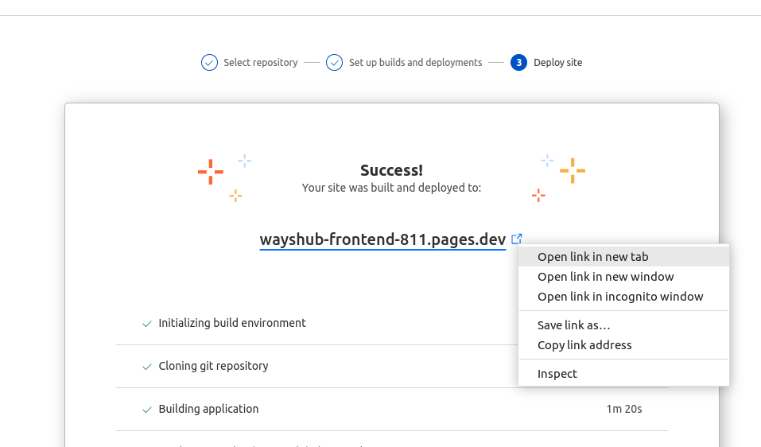

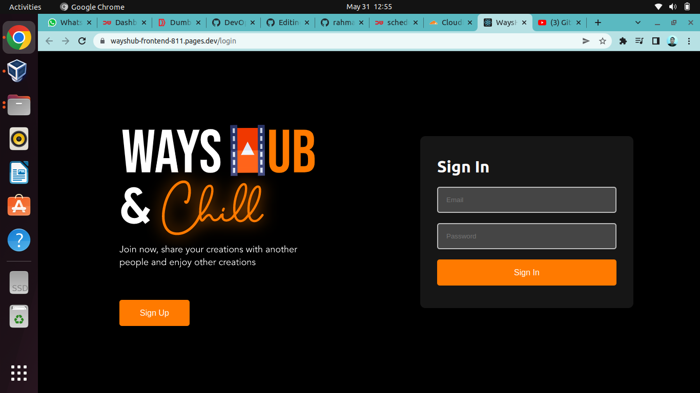

9.Kemudian kita cek status dari CI/CD kita tadi

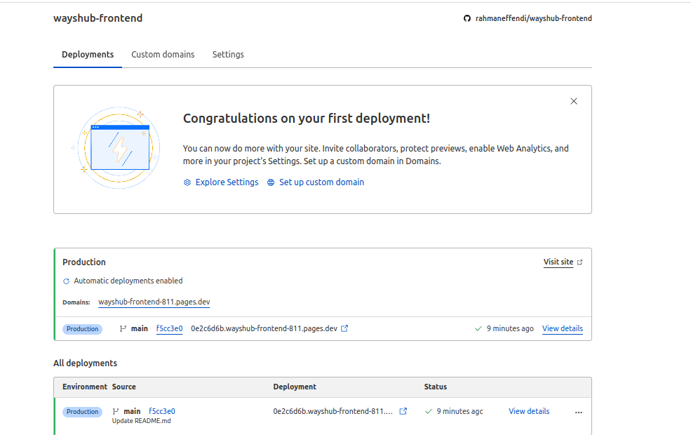

# Step 4 -Melakukan Perubahan Isi File 

1. kita akan mengubah title `wayshub` menjadi `wayshub Abdul-Rahman`.

Pertama kita masuk ke repository yang kita fork tadi, kemudian masuk ke file `public/index.html` bagian `<title>WaysHub</title>` menjadi `<title>WaysHub - Nama Anda</title>`

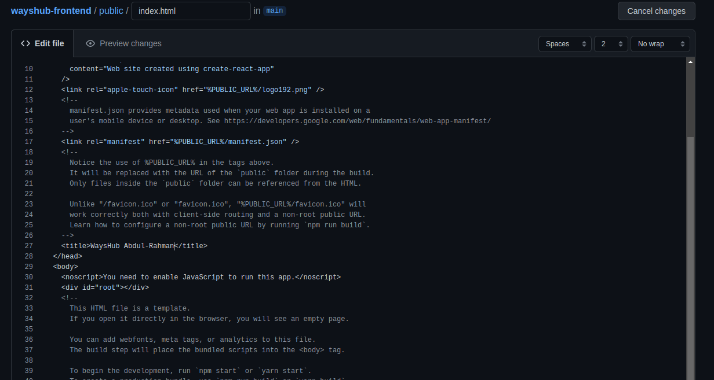

2. Dan secara otomatis CI/CD kita akan melakukan proses build dan deploy dengan sendirinya dapat dilihat di status berikut:

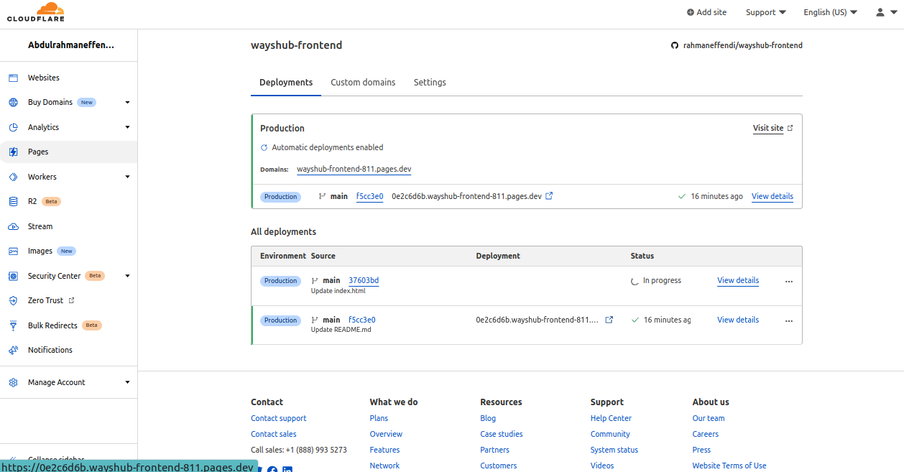

3. Dapat dilihat Log dari proses build kita 

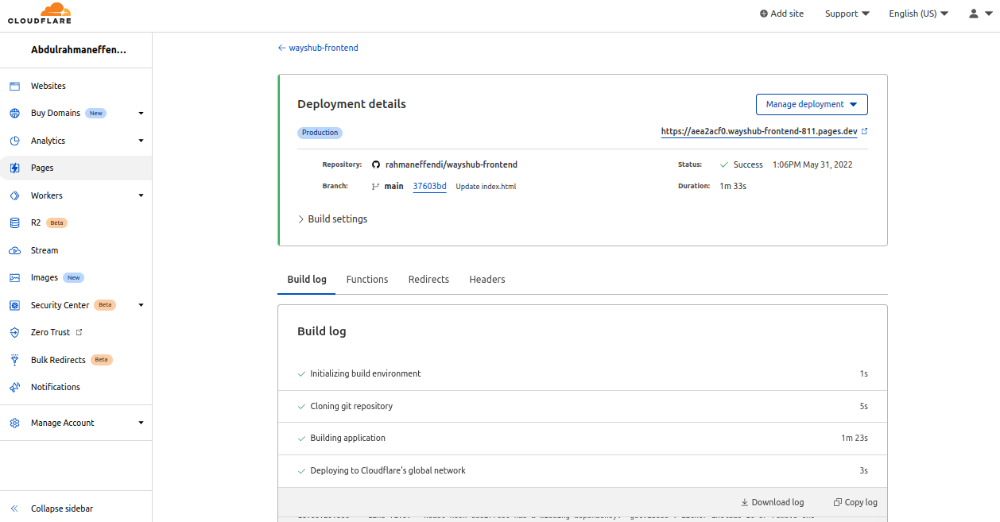

4. Dan jika proses CI/CD berhasil maka Log kita akan memberitahu kita.

5. Dapat dilihat hasil CI/CD berjalan dengan baik dan web yang tadinya title hanya "Wayshub" sekarang berubah menjadi "Wayshub - Akmal Ikhsan" yang artinya proses CI/CD kita berhasil!

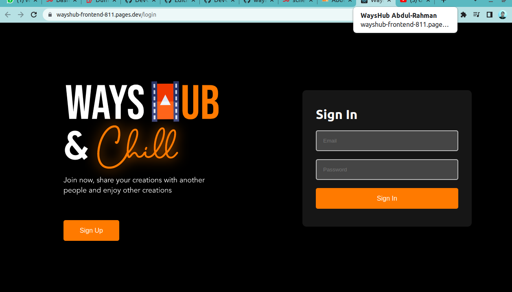

dari yang sebelumnya hanya wayshub saja

## Selesai

## Sekian Dan Terimakasih

