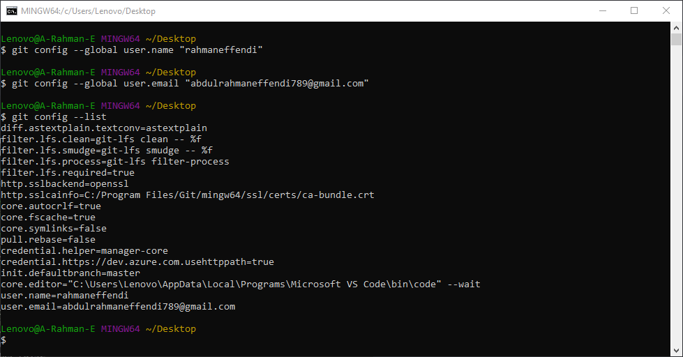
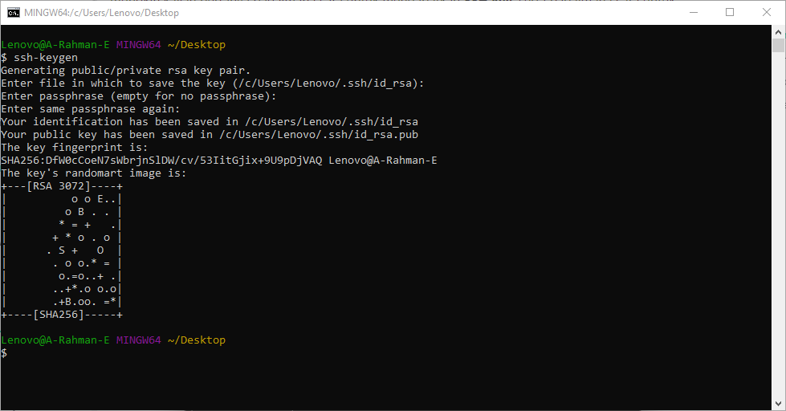
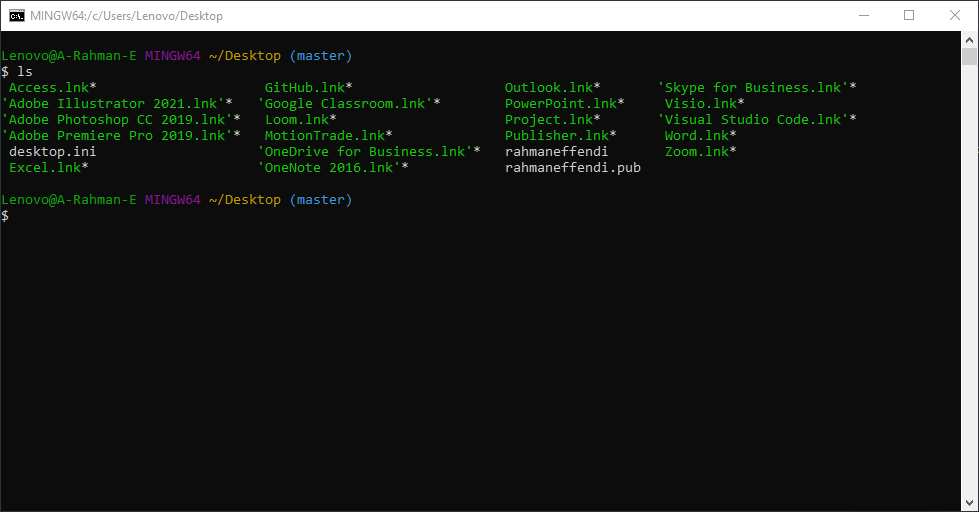
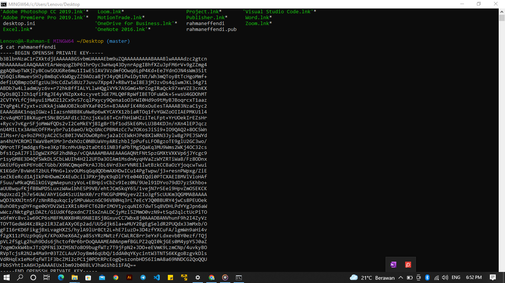
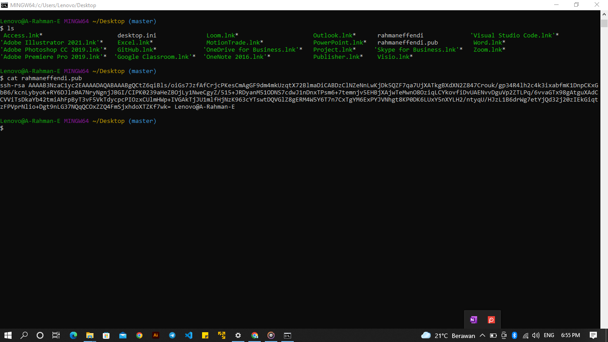
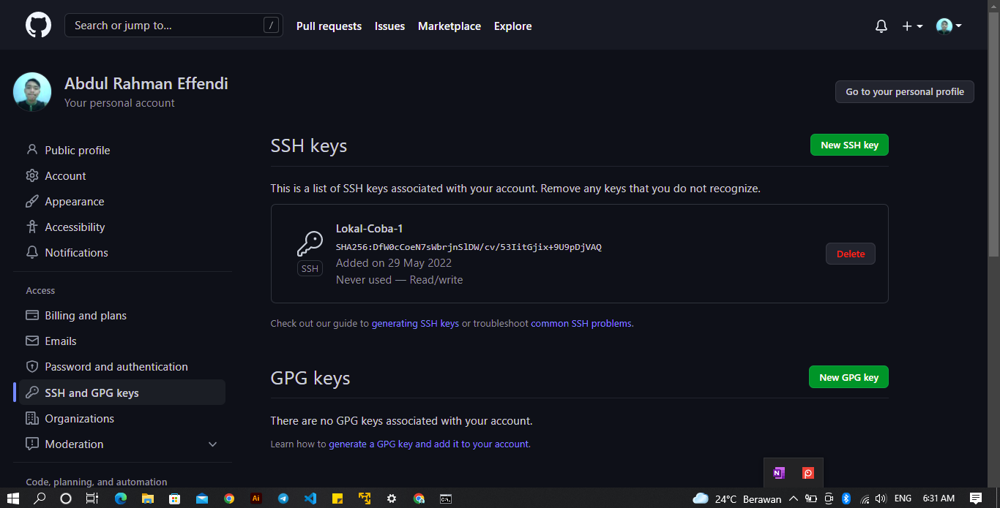
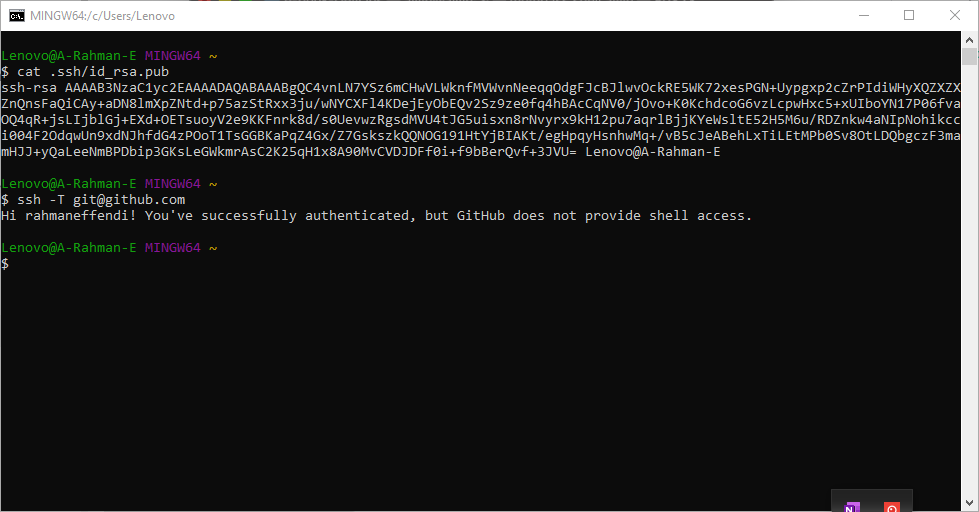

# Task Version Control System

# Git
Menurut Saya, Git merupakan software untuk mengatur versi aplikasi, yang mana git ini mempunyai platform yaitu Github untuk mempermudah penggunanya. kini github bisa menjadi portofolio kita agar orang lain bisa mengetahui kualitas kita.

# Git Configuration 

## Step 1 - Konfigurasi Git dengan Github
Jika sudah menginstall git , maka selanjutnya masuk ke terminal , kemudian masukan perintah di bawah ini :

```
git config --global user.name ".................."
```

isi titik-titik diatas menggunakan username github 

```
git config --global user.email "................."
```

isi titik-titik diatas dengan menggunakan email di github

```
git config --list
```

perintah diatas untuk mengecek apakah sudah config atau blum 




# Step 2 - Menghubungkan SSH

1.SSH memungkinkan kita untuk melakukan push ke repository github tanpa login. Berbeda dengan cara yang biasa (melalui HTTPS), kita harus memasukkan username dan password setiap kali melakukan push. Tapi dengan SSH kita tidak akan melakukan itu lagi.

Untuk generate nya, masukan perintah berikut :

```
ssh-keygen
```




## SSH key Location

Jika kalian sudah menjalankan perintah sebelumnya maka kalian sudah berhasil untuk men-generate SSH key yang akan kalian gunakannya. Untuk lokasi SSH key yang sudah kalian generate tadi berada di .ssh/id_rsa.pub. Jika sudah lakukan copy pada SSH-key tersebut.

```
cat .ssh/id_rsa.pub
```


## Add new SSH to github settings

Tahap selanjutnya setelah kalian melakukan copy SSH-key adalah memasukkannya kedalam config github dengan membuka https://github.com/settings/keys.

Jika sudah langsung tekan saja di bagian New SSH key.


Setelah itu masukkan saja SSH key yang sudah kalian copy tadi kebagian key. Jika sudah Langsung saja save dengan menge-klik bagian Add SSH key.





## Check Connection

Jika kalian sudah melakukan semua step di atas maka kalian sudah berhasil meng-koneksikan local kalian dengan Github.

Untuk make sure apakah sudah terkoneksi kita bisa menggunakan perintah di bawah ini.

```
ssh -T git@github.com
```



Jika muncul teks seperti gambar diatas. maka kalian sudah berhasil mengkoneksikan local kalian dengan Github.


