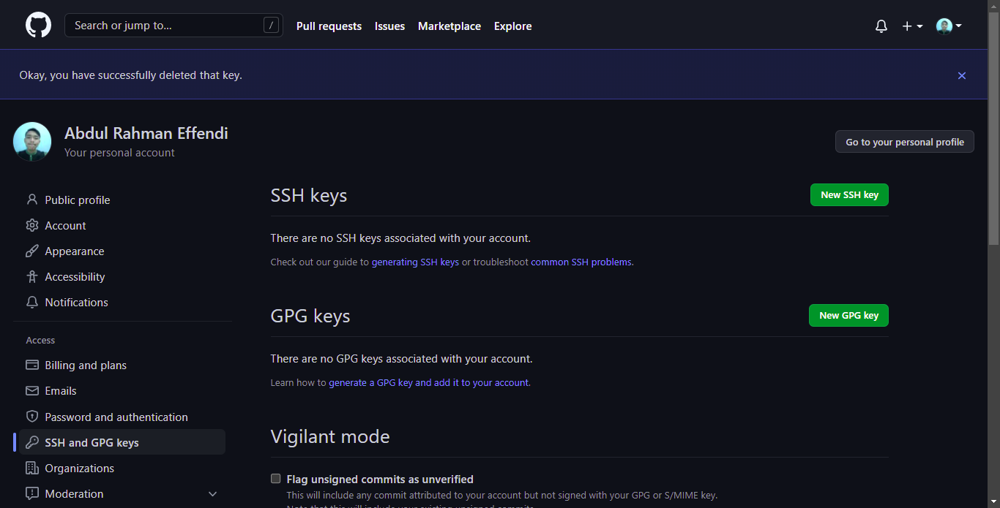
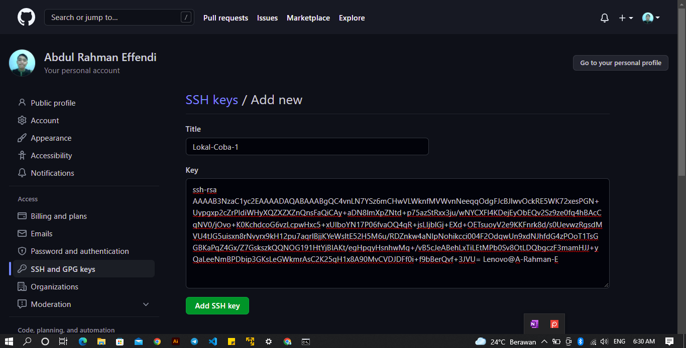

# Task Version Control System

# Git
Menurut Saya, Git merupakan software untuk mengatur versi aplikasi, yang mana git ini mempunyai platform yaitu Github untuk mempermudah penggunanya. kini github bisa menjadi portofolio kita agar orang lain bisa mengetahui kualitas kita.

# Git Configuration 

## Step 1 - Konfigurasi Git dengan Github
Jika sudah menginstall git , maka selanjutnya masuk ke terminal , kemudian masukan perintah di bawah ini :

```
git config --global user.name ".................."
```

isi titik-titik diatas menggunakan username github 

```
git config --global user.email "................."
```

isi titik-titik diatas dengan menggunakan email di github

```
git config --list
```

perintah diatas untuk mengecek apakah sudah config atau blum 


# Step 2 - Menghubungkan SSH

1.SSH memungkinkan kita untuk melakukan push ke repository github tanpa login. Berbeda dengan cara yang biasa (melalui HTTPS), kita harus memasukkan username dan password setiap kali melakukan push. Tapi dengan SSH kita tidak akan melakukan itu lagi.

Untuk generate nya, masukan perintah berikut :

```
ssh-keygen
```


2.kemudian kita liat list yang ada 


3.Di bagian Username saya, ada private key dan key penghubung 



Diatas adalah private key untuk terhubung ke server



Diatas adalah Key untuk penghubung ke github , gitlab dll.

4.Jika Sudah kita copas private penghubung tersebut ke github kita dengan cara masuk ke setting, kemudian masuk ke bagian ``` ssh key ``` kemudian buat ssh key yang baru, dan nantinya kita save , sehingga ter-save seperti gambar dibawah ini :


5.Setelah itu kita cek apakah sudah terkoneksi lokal kita dengan Github dengan perintah berikut :

```

```


