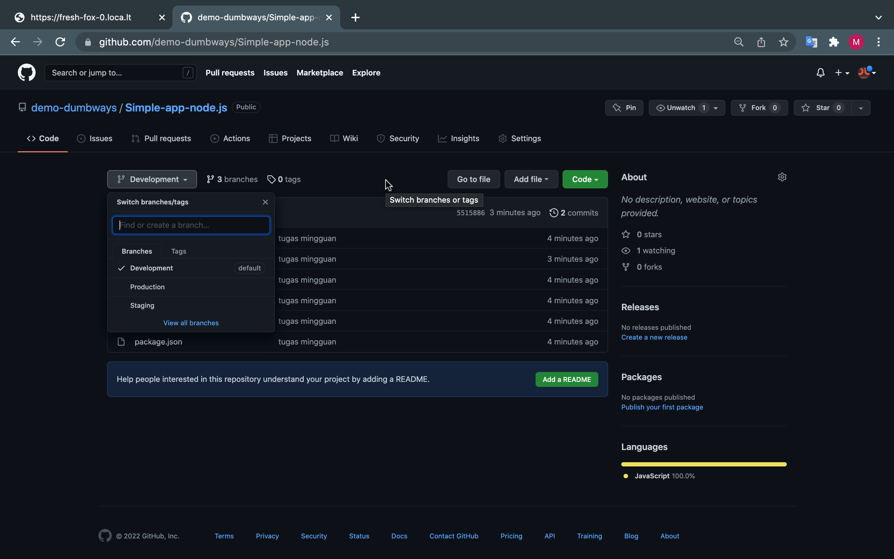

# Task Day 4 = Version Control System

# Instruksi
CAUTION
Pastikan untuk melakukan screenshot step by step yang dilakukan, untuk digunakan sebagai dokumentasi tugas.

Setelah mempelajari bagaimana cara menginstall git, mengkonfigurasi serta menggunakan git, maka silakan buat sebuah repository dengan ketentuan sebagai berikut:

# Ketentuan

Siapkan 3 buah repository untuk masing-masing aplikasi Node.js, Python dan Go yang telah dibuat
Buatlah 3 buah branch pada masing-masing aplikasi tersebut yaitu development, staging dan production
Pada setiap aplikasi tersebut lakukan push ke semua repository yang telah dibuat

# Pengumpulan
Pastikan untuk mengerjakan tugas mingguan pada medium.com.
Tulis step-by-step yang telah Anda lakukan secara detail dan sertakan screenshot setiap prosesnya.
Setelah menyelesaikan tugas, silakan publish artikel yang sudah dibuat.
Referensi:

# Project Management

Tambahkan deskripsi berikut ke dalam kanban pada project management Anda

Melakukan versioning menggunakan git pada semua aplikasi (NodeJS, Python dan Go).

- [ ] Definisikan apa itu Git menurut pemahamanmu
- [ ] Buat 3 buah repository untuk masing-masing aplikasi (NodeJS, Python dan Go)
- [ ] Buatlah 3 buah branch pada masing-masing aplikasi tersebut yaitu development, staging dan production
- [ ] Pada setiap aplikasi tersebut lakukan push ke semua repository yang telah dibuat
Referensi:

Membuat GitHub Project
Manage GitHub Issue

# Diskusi
Silakan diskusikan terkait kendala atau kesulitan selama pembelajaran pada platform diskusi (slack/talk.ink) dengan membuat thread, misalnya "Introduction DevOps: problem cannot connect to network in VMware"
