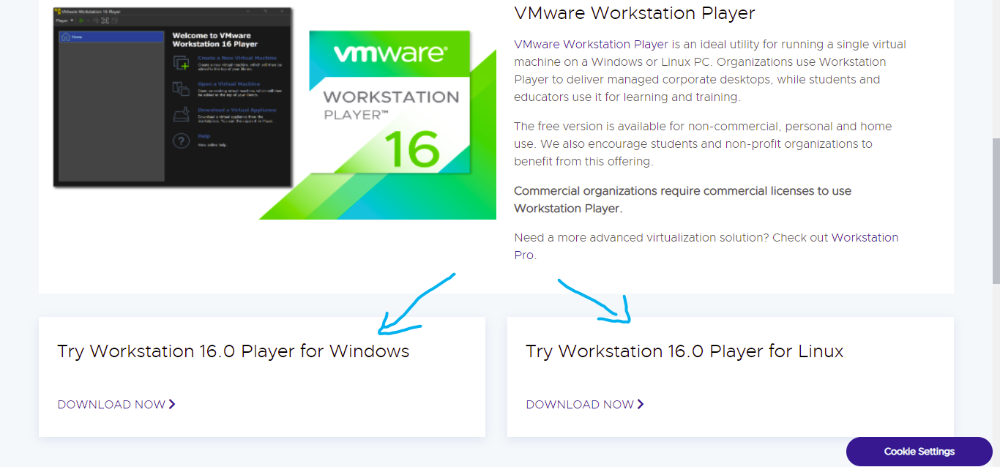
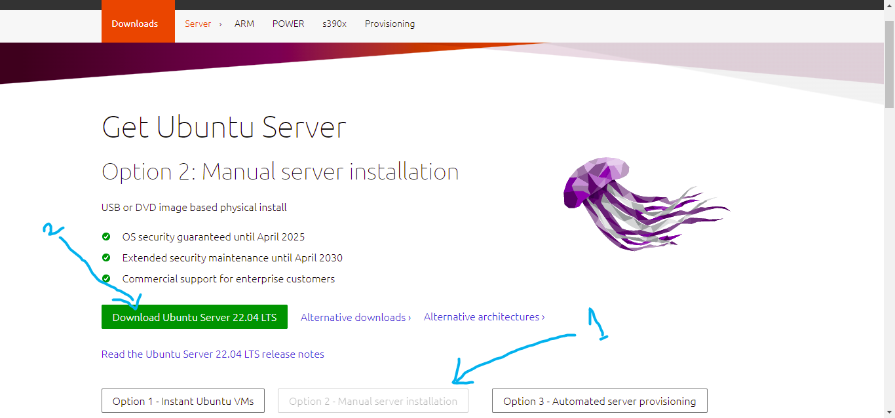
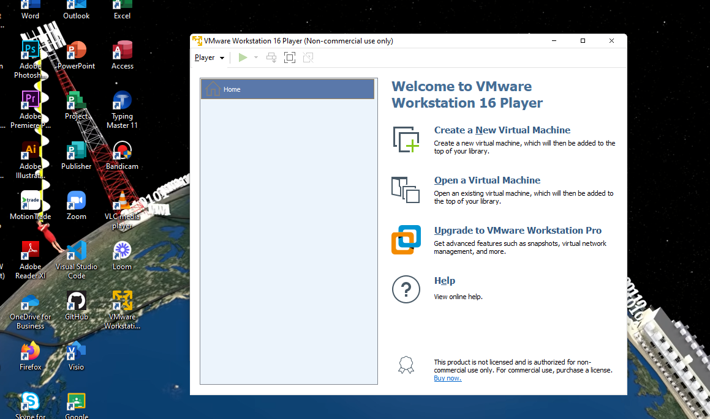
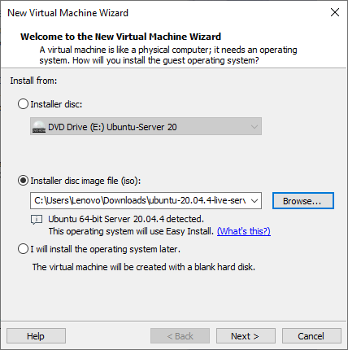
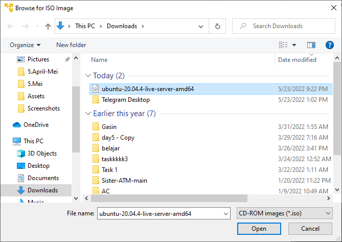
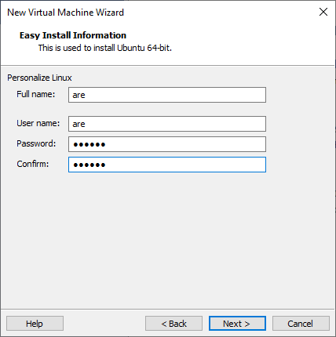
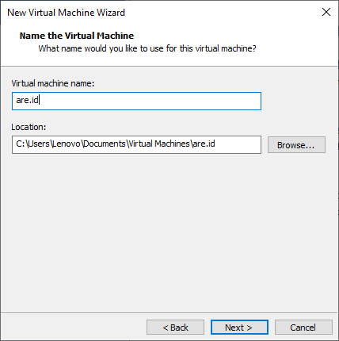

# Requirements

Sebelum melakukan instalasi ubuntu server, hal pertama yang harus kita lakukan adalah menginstall tools virtual machine serta meng-unduh file ISO server terlebih dahulu.Pada materi kali ini, kita akan menggunakan tools VMware Workstation Player.

Silahkan klik link dibawah untuk meng-unduh tools yang diperlukan.

VMware Installation : https://www.vmware.com/products/workstation-player/workstation-player-evaluation.html

akan tampil 2 option

silahkan di pilih sesuai os

Ubuntu Server 20.04 : https://ubuntu.com/download/server

klik 1 dulu kemudian 2

ket : menggunakan Versi 20 untuk pemula

# Installation Ubuntu Server

1.Buka Virtual machine kalian, untuk contohnya disini menggunakan VMware. Jika sudah langsung klik saja di bagian Create a new Virtual Machine.

2.Jika sudah nanti akan masuk ke halaman seperti gambar dibawah. Disini kalian pilih saja di bagian installer disc image(iso). Setelah itu masuk ke bagian browser lalu cari lokasi ISO ubuntu server yang sudah kalian download sebelumnya.

3.Lalu tahapan selanjutnya masukan saja user dan password yang kalian inginkan.

4.Tahapan selanjutnya adalah menentukan lokasi dimana Virtual machine kalian ingin disimpan.

