# Requirements

Sebelum melakukan instalasi ubuntu server, hal pertama yang harus kita lakukan adalah menginstall tools virtual machine serta meng-unduh file ISO server terlebih dahulu.Pada materi kali ini, kita akan menggunakan tools VMware Workstation Player.

Silahkan klik link dibawah untuk meng-unduh tools yang diperlukan.

VMware Installation : https://www.vmware.com/products/workstation-player/workstation-player-evaluation.html

akan tampil 2 option

silahkan di pilih sesuai os

Ubuntu Server 20.04 : https://ubuntu.com/download/server

klik 1 dulu kemudian 2

ket : menggunakan Versi 20 untuk pemula

# Installation Ubuntu Server

1.Buka Virtual machine kalian, untuk contohnya disini menggunakan VMware. Jika sudah langsung klik saja di bagian Create a new Virtual Machine.

2.Jika sudah nanti akan masuk ke halaman seperti gambar dibawah. Disini kalian pilih saja di bagian installer disc image(iso). Setelah itu masuk ke bagian browser lalu cari lokasi ISO ubuntu server yang sudah kalian download sebelumnya.

3.Lalu tahapan selanjutnya masukan saja user dan password yang kalian inginkan.

4.Tahapan selanjutnya adalah menentukan lokasi dimana Virtual machine kalian ingin disimpan.

5.Setelah atur size disk yang ingin kalian gunakan. Disini sebagai contoh saya menggunakan 10GB. Disini ada 2 pilihan yaitu Store Disk as a single file dan Split virtual disk into multiple files.

Keterangan :

Store Disk as a single file maksudnya adalah disk yang kalian buat itu nantinya akan langsung terbuat 10Gb. (ini tidak disarankan untuk pengguna yang memiliki hardisk yang berkapasitas kecil).

Split virtual disk into multiple files maksudnya adalah disk yang kita pakai untuk virtual machine kita nantinya itu akan dibagi menjadi beberapa bagian. Jadi walaupun kita menggunakan disk berkapasitas 10Gb itu nanti tidak akan terpakai seluruhnya.

6.Sekarang kita akan meng-customisasi hardware untuk server kita, tekan saja di bagian Customize Hardware.

7.Disini ada beberapa pilihan untuk kita melakukan customisasi seperti Memory, Processors dan Network adapter.

Keterangan:

Memory berfungsi untuk penyimpanan data yang ingin kita gunakan untuk Virtual Machine yang ingin kita buat. Disini kita pilih gunakan saja defaultnya yaitu sebesar 4Gb tetapi misalkan kalian merasa kurang kalian boleh untuk menaikkannya sesuai keinginan kalian.

Processors adalah salah satu komponen penting untuk Virtual Machine yang ingin kita bangun, serta berfungsi untuk memproses data dan mengontrol sistem yang ada pada Virtual Machine kita. Disini kita menggunakan defaultnya saja yaitu sebesar 2 core.

Network adapter berfungsi untuk menghubungkan komputer ke jaringan. Untuk penjelasan lebih lanjut ada di poin berikutnya.

8.Jika sudah selesai untuk meng-setting memory dan processor, kalian bisa pergi ke bagian Network Adapter.
Keterangan:

kalau menggunakan NAT nantinya server yang kita buat ini akan mendapatkan IP yang sudah di sediakan oleh Virtual Machine kita.

Kalau Menggunakan Bridge nantinya server yang kita buat akan mendapatkan IP dari internet yang sedang kita gunakan.

9.jika sudah lalu klik close

10.Setelah nanti kalian akan di kembalikan ke halamannya sebelumnya, setelah itu tekan saja di bagian Finish.

11.Jika sudah nantinya kalian akan langsung di arahkan ke bagian installasi, disini kalian tunggu saja sampai prosesnya selesai.

12.Jika sudah kalian akan muncul tampilan seperti gambar dibawah ini. Setelah itu pilih bahasa yang ingin digunakan English.
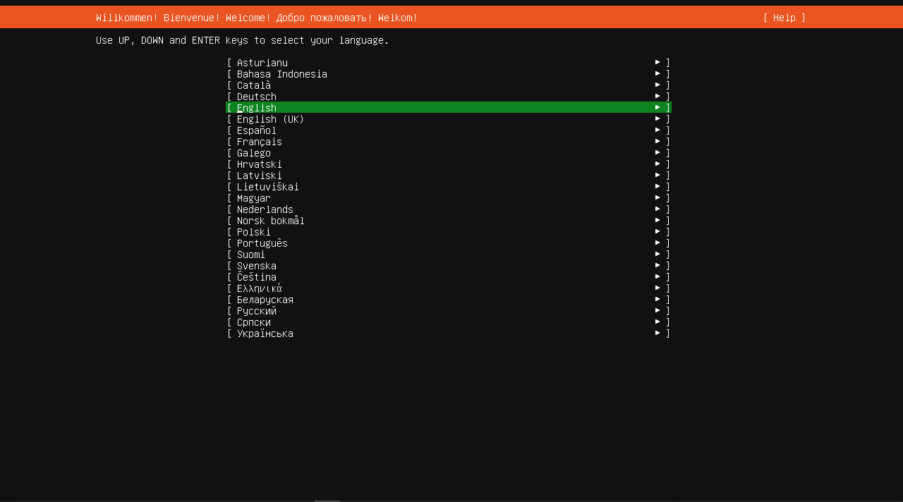

13.Proses ini bisa langsung kalian skip dengan klik continue without updating lalu skip juga dengan Done.

15.Pilih di bagian ens33, setelah itu pada bagia IPv4 Method ubah dari yang awalnya automatic menjadi manual. Setelah itu masukan detail IP pada form yang tersedia(kalian bisa masukkan saja IP yang sudah tertera di bagian DHCPv4). Jika sudah langsung tekan saja Save.

Keterangan:

-Subnet : Istilah teknologi Informasi yang membedakan Network ID dan Host ID atau sebagai penentu porsi Network ID dan Host ID pada deretan kode biner

-Address : Alamat IP yang akan digunakan untuk Virtual Machine yang akan kalian buat. (kalian dapat mengisi bagian ini dengan IP yang sudah ada di bagian DHCP)

-Gateway : Perangkat komputer yang berfungsi untuk mengkoneksikan sebuah Jaringan komputer terhadap satu jaringan komputer yang lain.

-Name servers : Dibagian Name servers ini kalian cukup memasukkan IP DNS dari google supaya dapat terhubung dengan browser.

16.Jika konfigurasi sudah selesai maka akan ada perubahan di bagian DHCPv4 tadi menjadi static.

17.Pada tahap selanjutnya kalian bisa skip dengan klik Done.

18.Pada tahap selanjutnya kalian bisa skip lagi dengan klik Done.

19.Disini kita dapat memilih bagian Custom storage layout. Kenapa kita memilih Custom storage layout karena kita akan membuat 2 buah partisi, jika sudah kalian pilih setelah itu langsung saja klik Done.
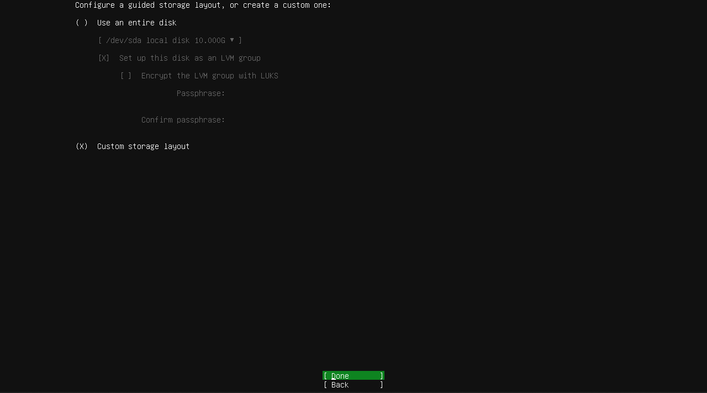

20.Selanjutnya disini kita akan membuat 2 buah partisi untuk root dan swap. Langsung pilih saja di bagian /dev/sda lalu pilih di bagian Add GPT Partition. Untuk kapasitasnya kalian bisa samakan saja dengan gambar dibawah (kecuali untuk swap, kalian bisa setting semau kalian apabila merasa kurang).

Keterangan :

-root adalah tempat dimana sistem kita itu ter-install.

-swap adalah suatu memory cadangan yang akan digunakan untuk server kita apabila memory utama sudah penuh.
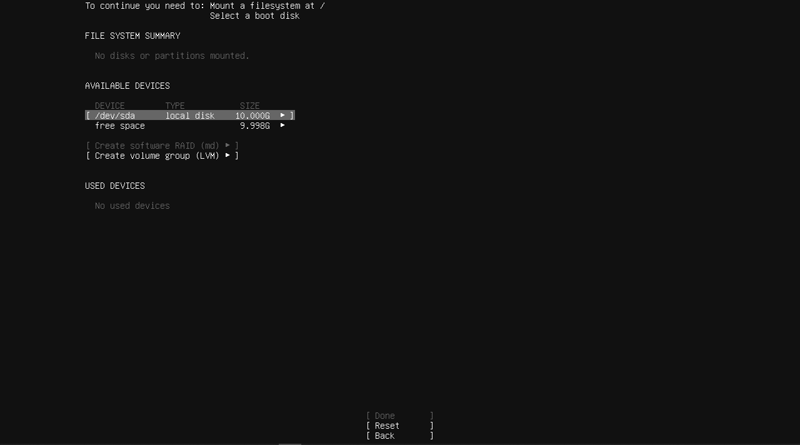
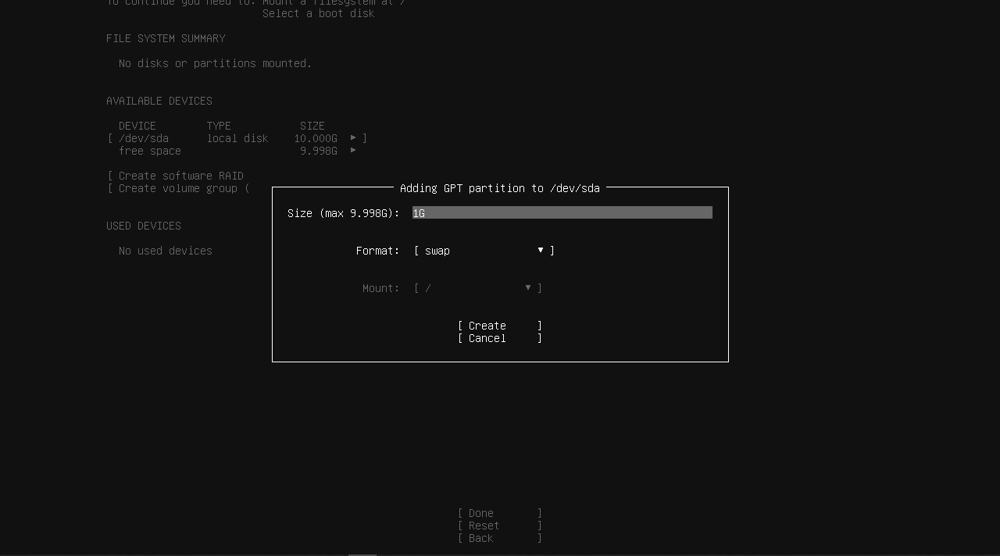

21.Jika sudah disini kita sudah berhasil membuat 2 partisi untuk root dan swap. Jika sudah langsung saja klik Done.
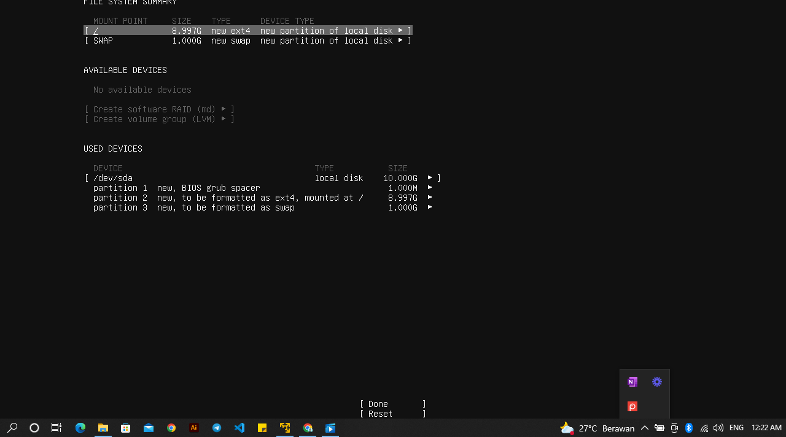

22.Lalu akan muncul notifikasi untuk mengkonfirmasi semua konfigurasi yang sudah kita buat. Jika sudah langsung klik saja Continue.
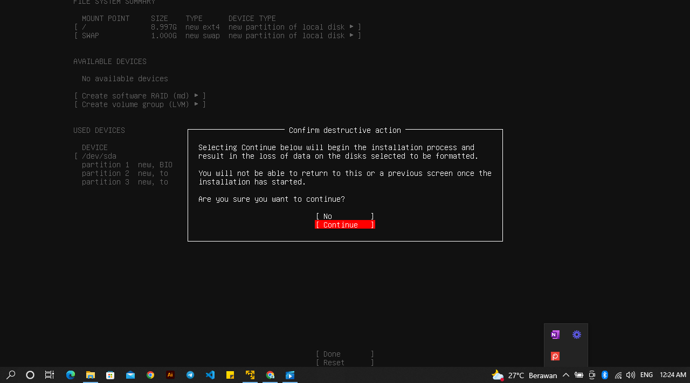

23.Selanjutnya masukan informasi seperti nama, username, dan password untuk server yang kalian buat. Jika sudah klik saja Done.
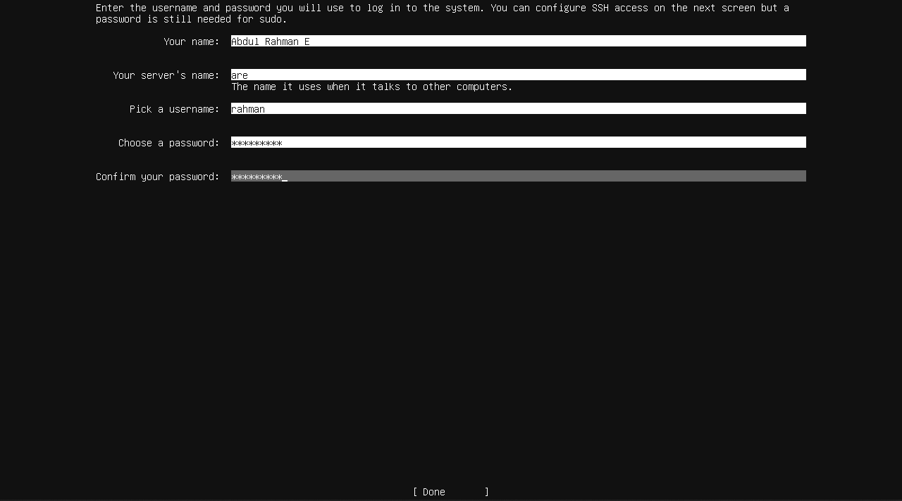

skip aja bagian ini 
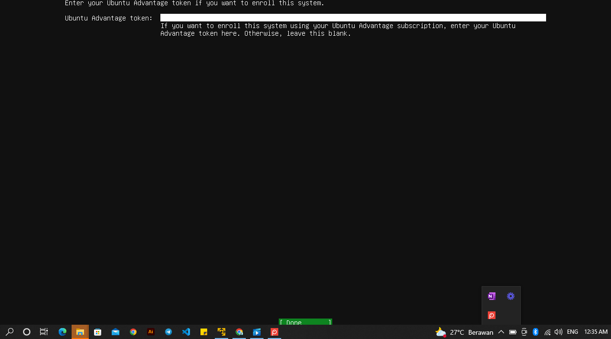

24.Ditahapan ini jangan lupa untuk checklist bagian Install OpenSSH server gunanya adalah untuk me-remote server yang kita buat.
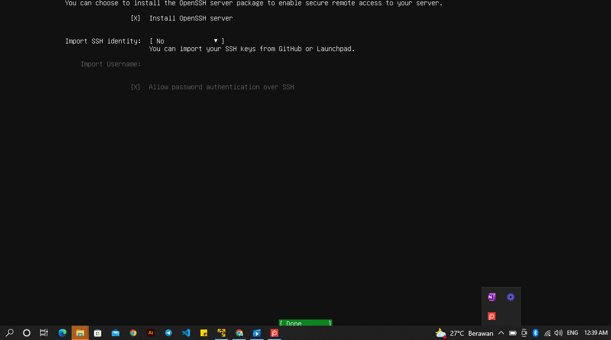

25.Pada tahap selanjutnya skip dengan klik Done.
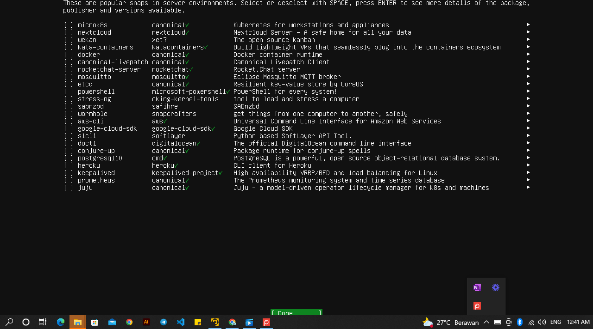

26.Kita sudah selesai untuk tahapan instalasinya. Tunggu saja proses instalasi sampai selesai jika sudah selesai langsung saja klik Reboot Now.
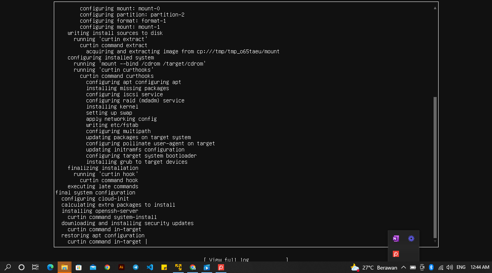

27.Jika tahapan installasi sudah selesai. Masukkan id beserta password yang sudah kalian set-up sebelumnya, Jika sudah maka kalian telah berhasil melakukan instalasi ubuntu server.
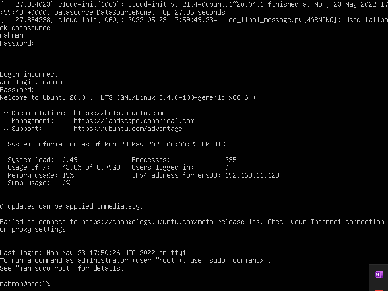

28.Untuk make sure apakah server yang kalian buat ini sudah terhubung ke dalam internet bisa gunakan perintah dibawah ini

ping google.com

-Jika server kalian sudah terhubung ke dalam internet maka akan muncul seperti gambar dibawah ini.

