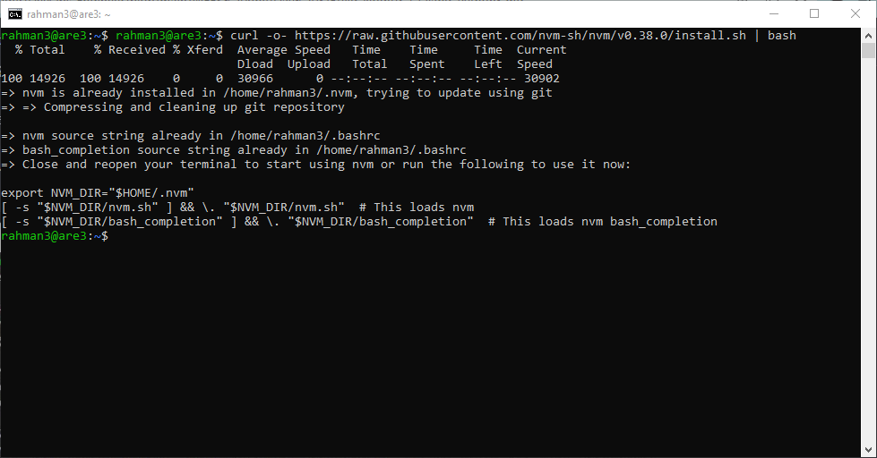

# Day 3
# Build dan Running aplikasi NodeJS, Golang dan Python3 dan Jalankan Secara Daemon Menggunakan PM2

## Step 1 -  Instalasi, Build dan Run Aplikasi NodeJS

1. Install terlebih dahulu engine NodeJS dengan cara perintah berikut:
  
```
curl -o- https://raw.githubusercontent.com/nvm-sh/nvm/v0.38.0/install.sh | bash
```



keterangan : disini kita menggunakan nvm

nvm merupakan singkatan dari Node Version Manager. nvm adalah sebuah program yang akan membantu kita untuk menggunakan lebih dari satu versi Nodejs di dalam satu komputer.

```
exec bash
```

keterangan : Jika nvm belum terdeteksi gunakan perintah di atas ini

```
nvm install 16
```


keterangan : perintah di atas berguna untuk menginstall node.js dengan versi 16. Jika kalian ingin menggunakan node.js dengan version 14, maka Jalankan perintah nvm install 14.

```
nvm use 16  
```


keterangan : Untuk menggunakan node.js dengan versi 16

Jika tahapan di atas sudah kalian lakukan, maka kalian sudah berhasil untuk melakukan instalasi node.js. Untuk melakukan pengecekan kalian bisa menggunakan perintah di bawah ini.

```
node -v
```

```
npm -v
```


Selanjutnya buat direktori my-app-nodejs, kemudian kita akan menjalankan perintah npm init gunanya untuk menginisiasi project, Hasil dari kalian menjalankan perintah akan membuat file baru dengan nama package.json, package.json ini berisikan isi informasi dari aplikasi yang akan kalian buat.

```
npm init -y
```


Selanjutnya kita akan menginstall Express JS. Express JS adalah framework dari NodeJS yang dirancang secara fleksibel dan sederhana untuk membantu tahap pengembangan aplikasi back end. Menginstall express js dapat dilakukan menggunakan NPM dengan perintah berikut:

```
npm install express --save
```


Jika sudah buat file dengan nama index.js, lalu masukan script dibawah ini

```
nano index.js
```

```
const express = require("express");
const app = express();
const port = 3000;

app.get("/", (req, res) => {
  res.send("Hello World!");
});

app.listen(port, () => {
  console.log(`Example app listening on port ${port}`);
});
```


Jika sudah sekarang kita akan coba untuk menjalankan aplikasi sederhana yang sudah kita buat. Untuk menjalankan dapat menggunakan perintah berikut ini.

```
node index.js
```


