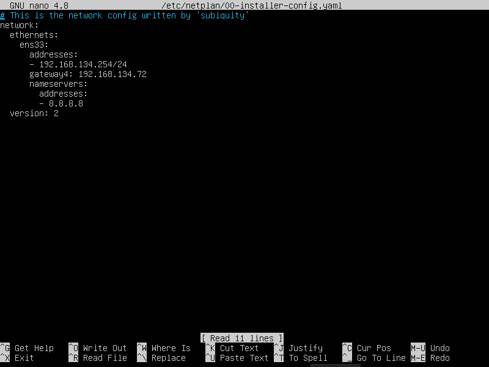
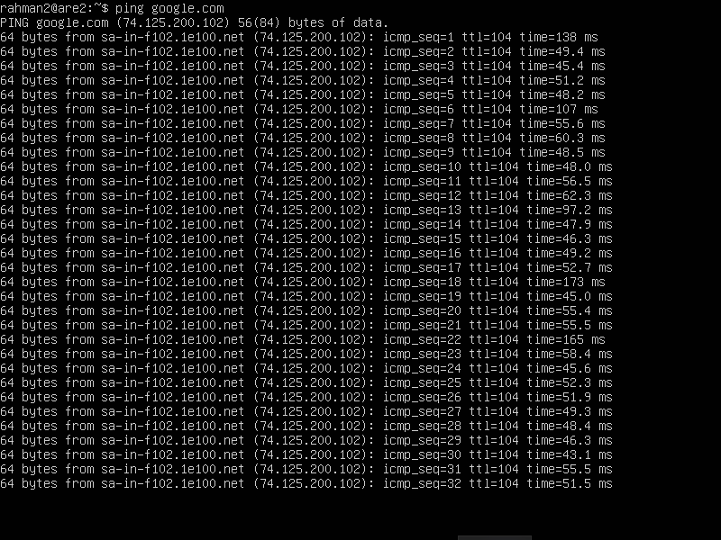

# Instalasi Apache2 Dan Tunneling

## Step 1 - Setting IP

1. langkah awal mensetting IP terlebih dahulu jika menggunakan jaringan bridge, maka kita gunakan IP dalam satu network dengan cara berikut:

```
sudo nano /etc/netplan/00-installer-config.yaml
```
Akan muncul sebagai berikut lalu ubah IP nya


2. Setelah selesai men-setting IP maka kita coba gunakan perintah `ping google.com` untuk mengetes koneksi dan jika berhasil maka akan muncul seperti gambar berikut


