# Instalasi Apache2 Dan Tunneling

## Step 1 - Setting IP

1. langkah awal mensetting IP terlebih dahulu jika menggunakan jaringan bridge, maka kita gunakan IP dalam satu network dengan cara berikut:

```
sudo nano /etc/netplan/00-installer-config.yaml
```
Akan muncul sebagai berikut lalu ubah IP nya


2. Setelah selesai men-setting IP maka kita coba gunakan perintah `ping google.com` untuk mengetes koneksi dan jika berhasil maka akan muncul seperti gambar berikut


# Step 2

## Apache2 Installation

1. Untuk mengecek IP yang sudah kita ubah tadi kita akan coba dengan remote server. Caranya masuk ke terminal lokal kalian dan masukan perintah berikut 

```
ssh rahman3@192.168.132.254
```
Untuk rahman3 kalian ganti dengan username Ubuntu Server kalian sendiri, jika ssh berhasil maka akan muncul seperti gambar berikut:

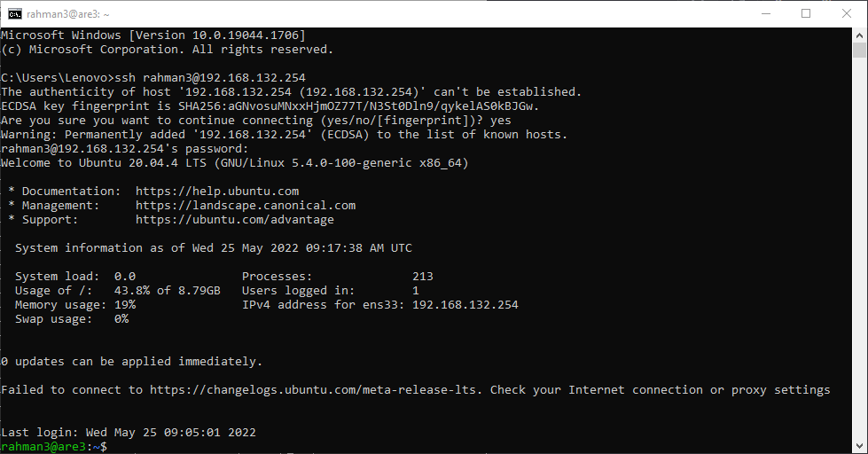

Selanjutnya tahapan pertama yang harus kita lakukan pada saat sedang berada di dalam server yaitu melakukan update serta upgrade terlebih dahulu gunanya untuk menjaga agar system kita tetap up-to-date.

Untuk melakukan update dan upgrade, kalian bisa menggunakan perintah di bawah ini.

```
sudo apt update; sudo apt upgrade
```

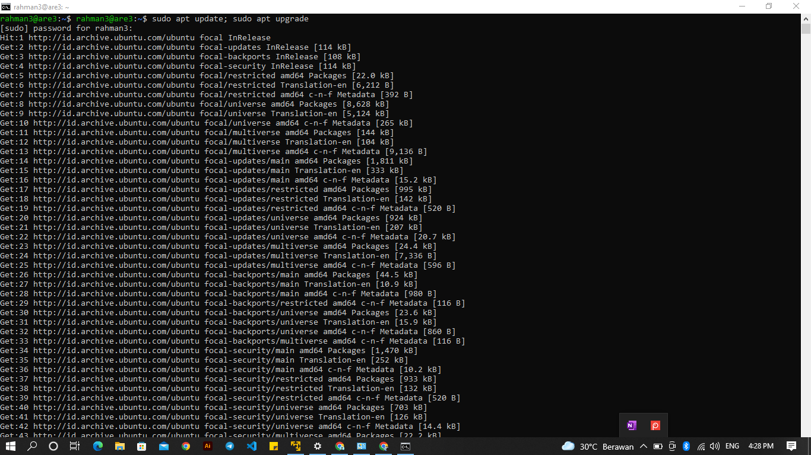

Selanjutnya kita akan coba untuk menginstall aplikasi Apache2.

Kalian bisa gunakan perintah di bawah ini.

```
sudo apt install apache2
```
Lalu nanti akan muncul notifikasi Do you want to continue? [Y/n] kalian ketik saja Y. Jika sudah maka instalasi akan berjalan.

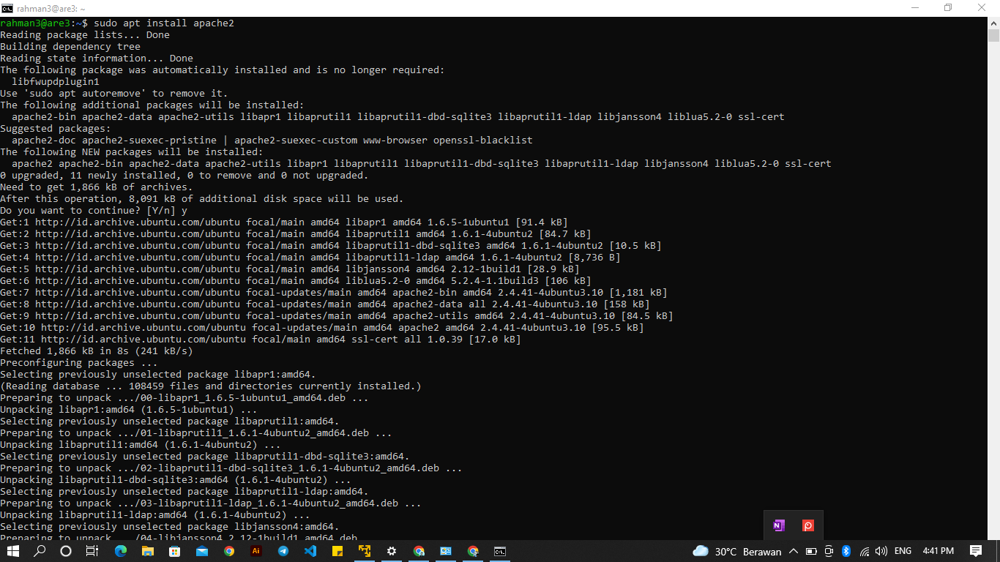

Jika instalasi sudah selesai kita bisa cek dengan menggunakan perintah dibawah ini.

```
sudo systemctl status apache2
```

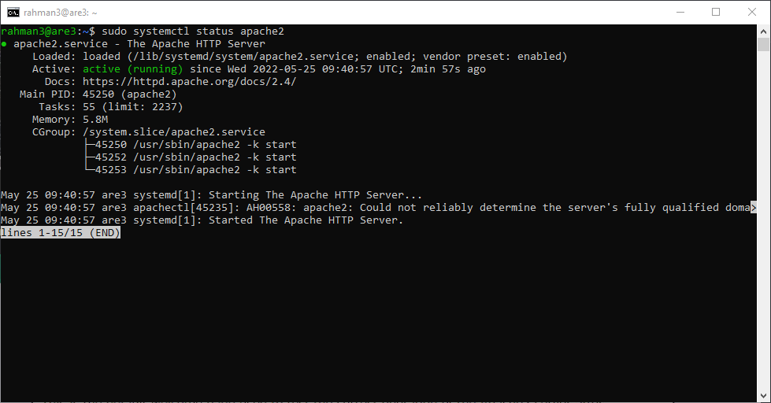

Sekarang coba buka browser kalian, lalu masukkan IP dari server kalian.


Dan instalasi Apache2 BERHASIL


# Step 3 - LocalTunnel

Pertama-tama yang kita lakukan adalah instalalsi node.js menggunakan nvm untuk melakukan instalasi kalian dapat mengikuti langkah-langkah dibawah ini.

```
sudo apt install curl
```

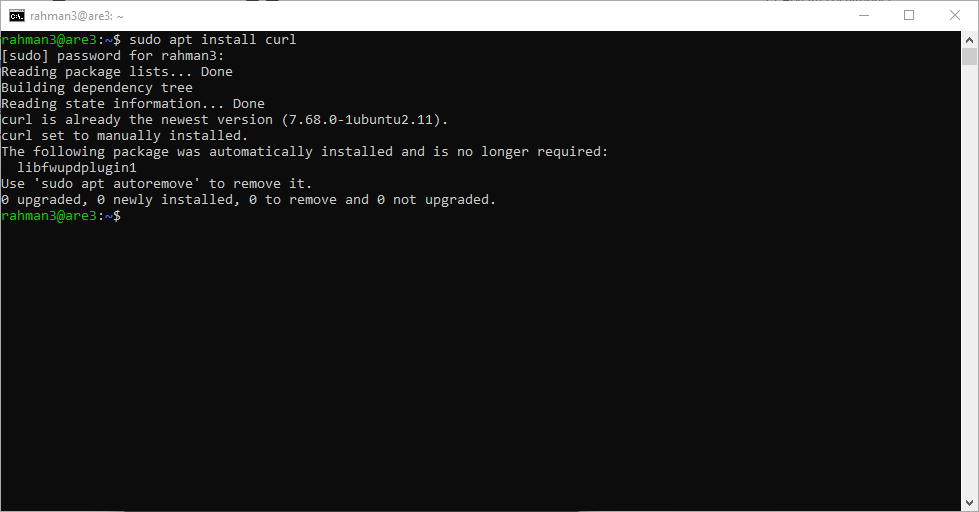

```
curl -o- https://raw.githubusercontent.com/nvm-sh/nvm/v0.39.1/install.sh | bash
```

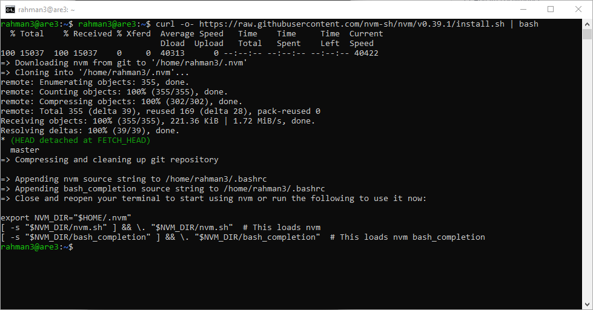

```
exec bash
```

```
nvm install 14
```

```
node -v
```

```
npm -v
```

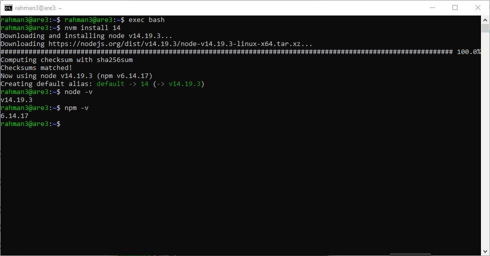


Selanjutnya kita akan melakukan instalasi localtunnel menggunakan npm yang sudah kita install.

```
npm install -g localtunnel
```

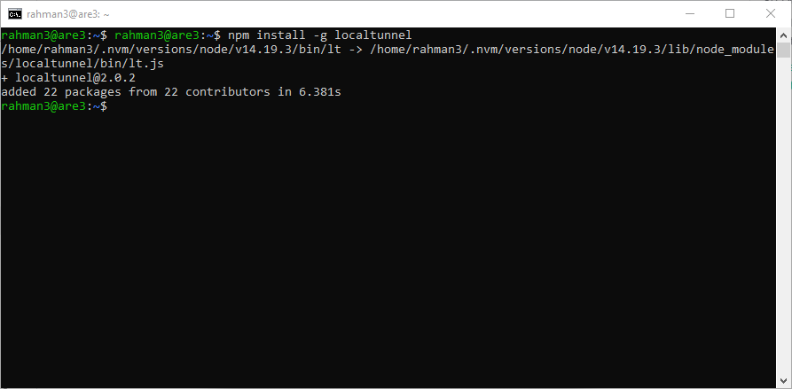

Sekarang kita akan melakukan instalasi Nginx yang sama seperti pertemuan sebelumnya.

```
sudo apt install apache2
```

Lalu nanti akan muncul notifikasi Do you want to continue? [Y/n] kalian ketik saja Y. Jika sudah maka instalasi akan berjalan.

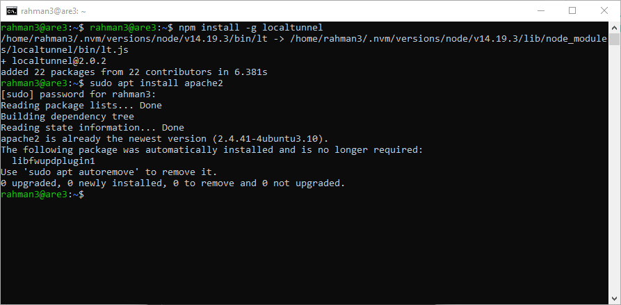

Jika instalasi kalian telah selesai melakukan instalasi Nginx, Selanjutnya kita coba untuk mengakses nginx di web browser kita untuk mengecek apakah Nginx kita sudah berjalan atau belum.

Coba kalian akses di web browser kalian, lalu masukkan IP dari server kalian.

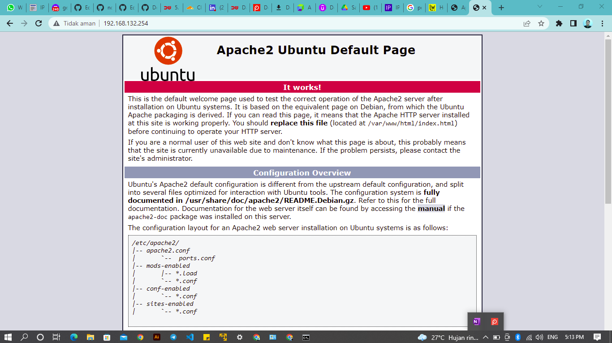

Sekarang kita coba untuk menggunakan localtunel untuk aplikasi apache2 yang sudah kita install.

Untuk menjalankan localtunel kalian dapat mengikuti perintah di bawah ini.

```
lt --port 80
```

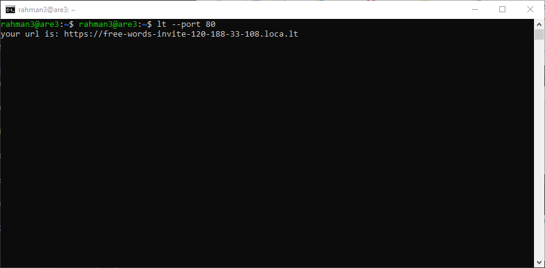

keterangan : pastikan dibagian port telah sesuai dengan aplikasi kalian. Karena setiap aplikasi pasti mempunyai port yang berbeda-beda, kita ambil contoh saja dari aplikasi node.js, aplikasi node.js biasanya berjalan di atas port 3000.

Jika sudah copy url yang ada di terminal kalian.

Setelah itu coba kalian akses menggunakan Web.browser kalian.

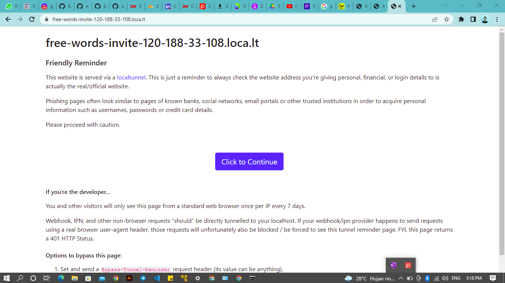

Jika sudah klik tombol Click to Continue.

Selanjutnya kalian akan di arahkan ke aplikasi kalian. Dan aplikasi kalian sekarang sudah dapat di akses oleh public.

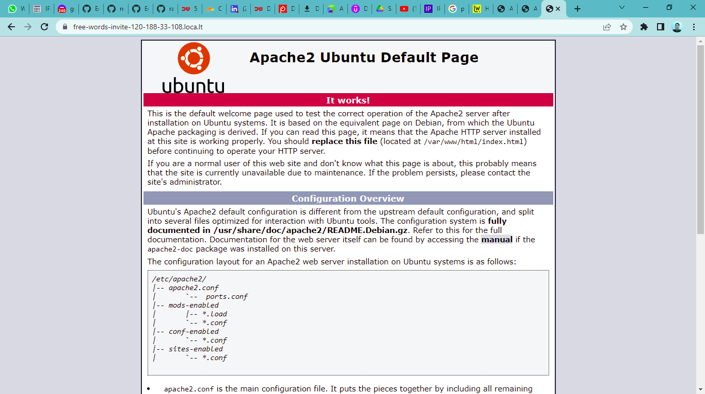

tampilan hp

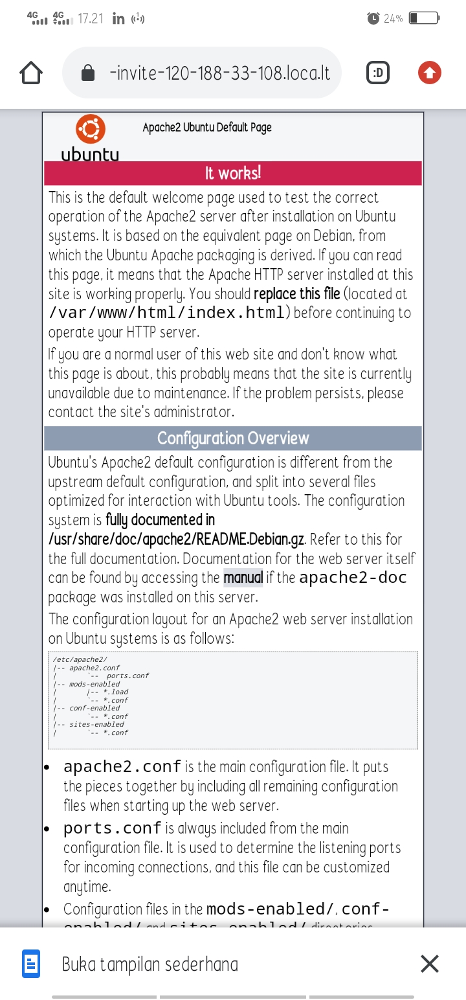


# Mantap, Selesai........
