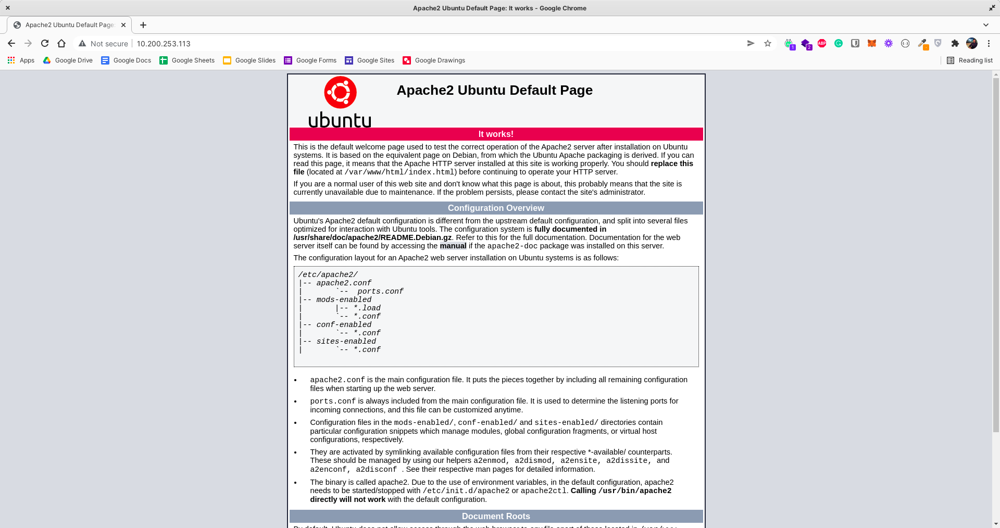

# 6. Task

# 6.1 Instruksi

CAUTION

Pastikan untuk melakukan screenshot step by step yang dilakukan, untuk digunakan sebagai dokumentasi tugas.

Setelah mempelajari terkait perintah dasar linux, konfigurasi jaringan, hingga tunneling maka silakan buat dokumentasi medium dengan ketentuan sebagai berikut:

# Ketentuan

Ganti IP lama dengan IP baru

Install Web Server Apache2 secara manual

Apache2 dapat diakses melalui browser menggunakan IP

Konfigurasi Apache2 agar dapat di akses publik dengan localtunnel

# 6.2 Pengumpulan 

Pastikan untuk mengerjakan tugas mingguan pada medium.com.

Tulis step-by-step yang telah Anda lakukan secara detail dan sertakan screenshot setiap prosesnya.

Setelah menyelesaikan tugas, silakan publish artikel yang sudah dibuat.

# 6.3 Project Management

Tambahkan deskripsi berikut ke dalam kanban pada project management Anda

Konfigurasi IP server dari IP lama ke IP baru, kemudian melakukan instalasi web server apache2 hingga dapat di akses secara public dengan localtunnel

- [ ] Definisikan apa itu Computer Network menurut pemahamanmu
- [ ] Buatlah daftar perintah linux yang membantumu untuk memanagement linux server
- [ ] Ganti IP server lama menjadi IP server baru
- [ ] Lakukan remote server tersebut menggunakan IP baru
- [ ] Install aplikasi web server apache di linux server
- [ ] Akses aplikasi web server apache2 menggunakan browser melalui IP
- [ ] Buatlah localtunnel pada web server apache2
- [ ] Akses aplikasi web server apache2 menggunakan localtunnel lewat HP

6.4 Diskusi

Silakan diskusikan terkait kendala atau kesulitan selama pembelajaran pada platform diskusi (slack/talk.ink) dengan membuat thread, misalnya "Introduction DevOps: problem cannot connect to network in VMware"
