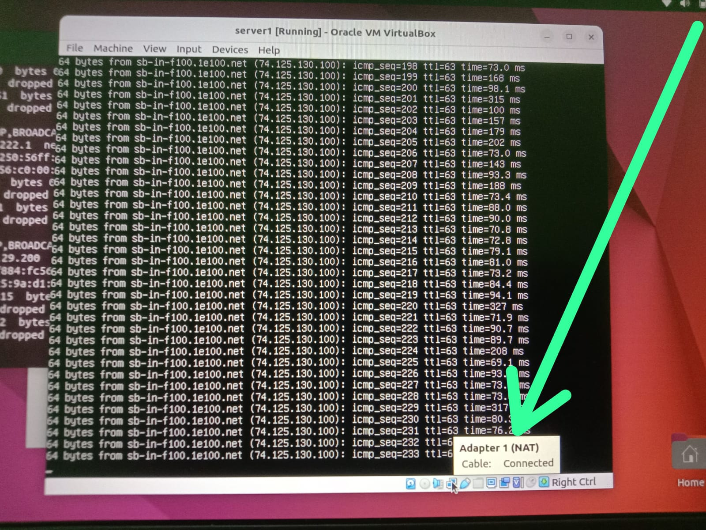
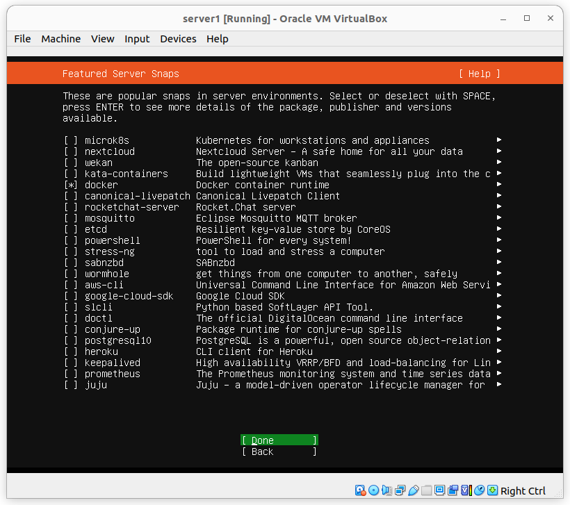

# 1.NAT Dan Instal Docker

Sebelum dualboot, saya pake windows dalam menjalankan servernya, Kemudian saya install dualboot linux ubuntu 22.04, dan Virtual Machinenya saya pake Virtual Box

Berikut Bukti saya sudah bisa menjalankan Nat 

Berikut Bukti saya sudah bisa menjalankan Nat 

# 2. Menjalankan Aplikasi Python

cat : saya masih blum bisa menggunakan server, diatas berjalan baru dari lokal saja
