# Cloud Computing


## Apa itu Cloud Computing?

Menurut Saya Cloud Computing Merupakan Suatu pengiriman layanan yang berbeda-beda melalui internet, seperti storage, database, Network, software dls


### Mengapa Menggunakan Cloud Computing ?

<li>Perusahaan Besar bahkan startup Sudah menggunakan cloud computing</li>

<li>mempermudah pembuatan server dan management bisnis</li>

<li>menghemat biaya</li>

<li>Efisiensi Kecepatan dan keamanan datanya Bagus</li>

<li>Lokasi data centernya bisa dimanapun</li>

<li>Adanya fitur Recovery dan Backup data</li>


## Type of cloud computing

1. Onpremise , Dimana kita memenage/mengatur sendiri keseluruhan aspek server, Seperti membuat server di lokal, 
 
   Seperti : Virtual Box, Vmware dls.

2. Iaas ( infrastruktur as a Service)
 
   Seperti : AWS, IdCloud Host, Oracle Cloud, Digital Ocean, GCP(Google CLoud Platform) dls.

3. Paas (Platform as a Service)

   Seperti : cloudflare pages, Vercel, Heroku, Netlify dls.

4. Saas (Software as a Service) , Dimana Keseluruhan aspek server sudah di manage/atur oleh pemberi layanannya,
   
   Seperti : Fb, Yt, Wa, Tiktok, Photoshop dls.
   
# step 1 - Membuat Server Aplikasi Menggunakan IdCloudHost

1. Pertama kita klik [link ini](https://console.idcloudhost.com/user/abdulrahmaneffendi789@gmail.com/lab) untuk masuk kedalam hal id cloud hostnya, kemudian akan tampil gambar di bawah ini :


kemudian akan muncul tampilan ini


kemudian ke bagian profile di sebelah kanan, kemudian klik profile (kita akan ganti akun), kemudian klik acces user d sebelah bawah


kemudian klik start


lalu, Disini Klik `Compute` dan klik `New` Untuk mulai membuat server nya


2. kemudian kita pilih :

<li>type nya : Virtual Machine</li>

<li>Os nya : Ubuntu 20.04lts </li>

<li>Location nya : Indonesia</li>


<li>Size nya : Disesuaikan Dengan Kebutuhan, Untuk pembelajaran disini Saya pakai `1 CPU` `1GB RAM` `20GB Disk` `50k/month`</li>

**`note : Jangan Lupa untuk ceklis Dibagian Public IP Agar server nya bisa diakses menggunakan IP Public`**

<li>Vpc : Gunakan Default saja</li>

<li>Username : Gunakan Default saja, Karena nanti kita akan membuat server lain sebagai user utama</li>

<li>pw : bebas</li>


<li>SSH : Boleh Digunakan Boleh tidak</li>

<li>Resource Name : Bebas, Disini saya Grouping</li>


Kemudian Klik `Create`


kemudian kita tunggu proses Building aplikasi servernya hingga selesai :


jika sudah akan muncul seperti ini :


________________________________________________________________________________________________________________________________________________________
Penjelasan Tambahan : 

<li>Vpc = Virtual Private CLoud, Suatu layanan yang disediakan untuk sejumlah orang tertentu aja, Biasanya diterapkan/digunakan dalam suatu perusahaan yang mempunyai sejumlah data yang besar juga bisa bersifat rahasia</li>
 
 <li>karakter private cloud ini dapat di scale secara mandiri dengan pengetahuan teknis, biasanya dilakukan oleh orang lapangan dan manajemen datanya hanya bisa di akses oleh orang-orang tertentu, dan tidak perlu membayar layanan karena sudah ada secara default, dan angka ipnya biasanya rapi</li>
 
 <li>cara konek ke vpc yaitu menggunakan VPN, dan biasanya di setup oleh orang lapangan(orang yang hidup di data center)</li>

<li>floating ip : Dimana nanti server kita mempunyai 2 ip address yang bersifat public dan private</li>

 
  
________________________________________________________________________________________________________________________________________________________

3. Setelah pembuatan servernya selesai, kita akan mengaksesnya dari lokal kita, cara nya sama seperti sebelumnya 

```
ssh user@.....ip.....
```


4. Setelahnya kita melakukan update

```
sudo apt update; sudo apt upgrade
```


5. Kemudian Kita menambahkan user lagi, selaku user utama 


user : anya
pw : anya123

untuk fullname sampai other di skip aja

6. setelah nya kita akan menyalakan `pubkeyauthenticationyes` dan `passwordauntheticationyes`nya

```
sudo nano /etc/ssh/sshd_config
```


7. Kemudian Kita reload dulu, kemudian izinkan user yang sudah kita buat dapat mengakses menggunakan perintah sudo, dan kita logout dari akun kita kemudian kita masuk ke user utama yang sudah kita buat tadi 

```
sudo systemctl reload sshd
```

```
sudo usermod -aG sudo anya
```

```
logout
```

```
ssh anya@103.176.78.23
```


8. Kemudian disini Saya akan mulai menjalankan aplikasi frontend wayshub 

Karena disini saya akan mendeploy aplikasi frontend dengan konfigurasi node js jadi terlebih dahulu saya akan menginstall NPM (Node Package Manager) dan NVM (Node Version Manager) terlebih dahulu

```
sudo apt install npm
```


selanjutnya saya akan install engine node.js nya 

```
curl -o- https://raw.githubusercontent.com/nvm-sh/nvm/v0.38.0/install.sh | bash
```

```
exec bash
```


```
nvm i 14
```

```
nvm -v
```

```
npm -v
```


Selanjutnya cloning fork https://github.com/dumbwaysdev/wayshub-frontend menggunakan perintah :

```
git clone https://github.com/dumbwaysdev/wayshub-frontend
```


Setelah itu jalankan perintah npm i untuk node_modulesnya

```
npm i
```


# Step 2 - Membuat Gateaway-Server Menggunakan Idcloudhost dan konfigurasi proxynya

1. Pertama kita Login ke akun idclouhost kita di [sini](https://console.idcloudhost.com/user/abdulrahmaneffendi789@gmail.com/lab)


2. Kemudian pilih menu Compute di kiri pojok dan pilih create new resource

Untuk type pilih app catalog dan Os nya Nginx


Kemudian isi username password dan resource name , untuk ssh ini opsional kemudian pilih create, untuk lokasi, saya pindah ke north jakarta, dikarenakan di pertengahan ada error


tunggu hingga selesai


jika sudah selesai, maka akan muncul ini 


3. Kemudian Kita akan remote server nya dari lokal kita :

```
ssh ubuntu@103.55.37.95
```


4. Kita  akan melakukan update dan upgrade pada server Gateway agar selalu terupdate 

```
sudo apt update ; sudo apt upgrade
```


5. Kemudian check versi nginx dengan menggunakan perintah

```
nginx -v
```

Seharusnya pada server Gateway ini otomatis terinstall nginx


6. Sebelumnya Disini saya akan membuat user yang lain sebagai utama dengan cara sebelumnya :

```
sudo adduser nginx
```


disini user : nginx, pw nya : nginx123

```
sudo nano /etc/ssh/sshd_config
```


```
sudo systemctl reload sshd
```

```
sudo usermod -aG sudo nginx
```

```
logout
```

```
ssh nginx@103.55.37.95
```


7. Selanjutnya buat direktori baru pada /etc/nginx , saya akan membuat direktori baru bernama wayshub dengan perintah

```
sudo mkdir wayshub
```


8. Selanjutnya saya akan membuat file untuk menyimpan konfigurasi dari reverse proxy

```
sudo nano proxy.conf
```

9. Kemudian masukan script dibawah ini 

```
server {
        server_name wayshub.xyz;

        location / {
                proxy_pass http://10.71.15.131:3000;
        }
}
```


Keterangan : server_name adalah nama server , proxy_pass isi dengan ip dari aplikasi

lalu save 


10. Kemudian masuk ke file nginx.conf untuk menambahkan konfigurasi proxypass


11. Kemudian Cek dan reload

```
sudo nginx -t
```

```
sudo systemctl reload nginx
```

```
sudo systemctl status nginx
```


# Step 3 - Menjalankan Aplikasinya

1. Pertama-tama kita beralih ke user aplikasi yang sudah kita buat di awal , kemudian masuk ke direktori aplikasinya , dan kita  akan menginstall PM2 yang tujuannya yaitu supaya aplikasi dapat berjalan pada background

```
npm install pm2 -g
```


2. Kemudian Kita akan membuat ekosistem pm2 ,

```
pm2 init simple
```

```
pm2 ecosystem simple
```


3. Kemudian masuk ke file ecosystem.config.js 


dan sesuaikan dengan script ini

```
module.exports = {
  apps : [{
    name   : "frontend-wayshub",
    script : "npm start"
  }]
}
```
kemudian save dan exit


4. kemudian kita jalan kan aplikasinya 

```
pm2 start ecosystem.config.js
```


5. dan kita cek browser kita 

```
103.176.78.23:3000
```


Disitu Meskipun kita keluar dari aplikasinya, statusnya masih tetap berjalan karena kita menggunakan pm2

# Step 4 - Membuat DNS (Domain Name Server)

Singkatnya, DNS adalah sebuah sistem yang mengubah URL website ke dalam bentuk IP Address. Tanpa DNS, Anda harus mengetikkan IP Address secara lengkap ketika ingin mengunjungi sebuah website

Disini saya akan membuat DNS pada aplikasi frontend wayshub menggunakan cloudflare

1. Daftar atau login terlebih dahulu di website [CloudFlare](https://dash.cloudflare.com/)

disini klik Studentnya


kemudian klik DNS


klik add record dan isi 


Isi nama dan ipv4(ip gateway) kemudian save

Domain yang saya buat : rahman.studentdumbways.id


diatas, kita edit menjadi dns only , agar nantinya kita bisa mengakses htpps


2. Kemudian Masuk ke terminal lagi server gateway dan melakukan konfigurasi baru pada /etc/nginx/wayshub

```
server { 
        server_name rahman.studentdumbways.my.id; 

        location /{
        proxy_pass http://103.176.78.23:3000;
        }
}
```


3. Kemudian kita cek di browser kita 

```
http://rahman.studentdumbways.my.id/
```


Apabila berhasil akan tampil aplikasi frontend menggunakan domain http://rahman.studentdumbways.my.id/

# Step 4 - Menggunakan SSL CertBot untuk mengamankan website

## Apa itu SSL ?

SSL adalah singkatan dari Secure Socket Layer, salah satu komponen penting yang harus dimiliki website. Dengan SSL, transfer data di dalam website menjadi lebih aman dan terenkripsi. Bahkan saking pentingnya, Google Chrome melabeli website tanpa sertifikat SSL sebagai Not Secure. 

SSL ini bersifat opensource dan gamapang konfigurasinya 

Apabila sistem keamanan ini ditambahkan pada website Anda, maka URL website akan berubah menjadi HTTPS. Tujuan utama pemasangan SSL adalah sebagai pengaman pertukaran data yang terjadi melalui jaringan internet.

1. langkah pertama masuk ke clouflare dulu , klik myprofile


klik API token


klik View DI global API key, dan masukan password cloudflare nya


kemudian copy tokennya


2. Kemudian balik ke gateway server dan buat direktori `.secret`, dan buat konfigurasi untuk cloudflare didalamnya 


masukan script berikut dan pastekan token didalamnya

```
dns_cloudflare_email = "abdulrahmaneffendi789@gmail.com"
dns_cloudflare_api_key = "dadd0433b3e3faf6a822472c0a7193e881169"

```


kemudian agar lebih aman kita akan mengatur izinnya agar hanya bisa di read aja

```
chmod 400 nginx.ini
```


jika sudah , maka cloudflare kita sudah terhubung dengan gateaway server kita

3. Langkah selanjutnya masuk ke gateaway server, dan instalasi certbot

kita pastikan dulu kalau snapd kita ter update

```
sudo snap install core; sudo snap refresh core
```


disini, server saya done, dan akan membuatnya kembali 

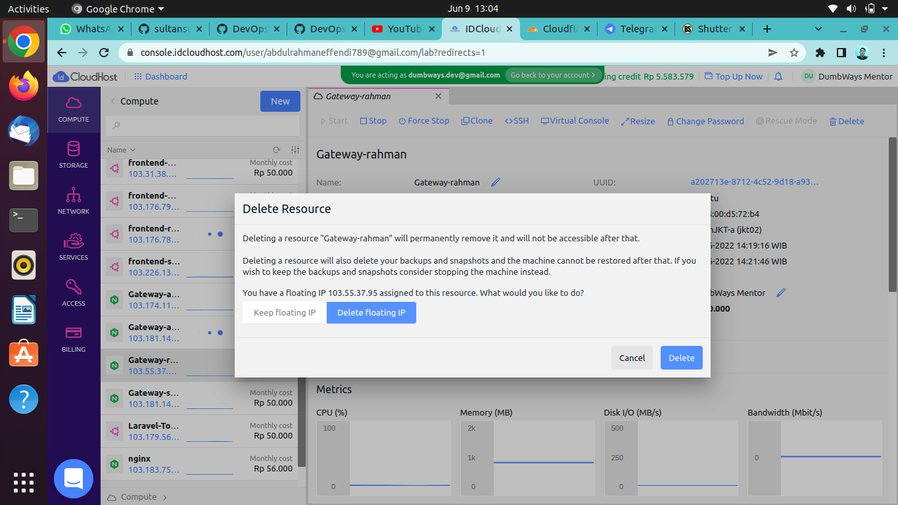

saya ganti dan buat lagi os = nginx ubuntu 20, dan 2 user, sebagai user utamanya "unyu" pw = unyu 

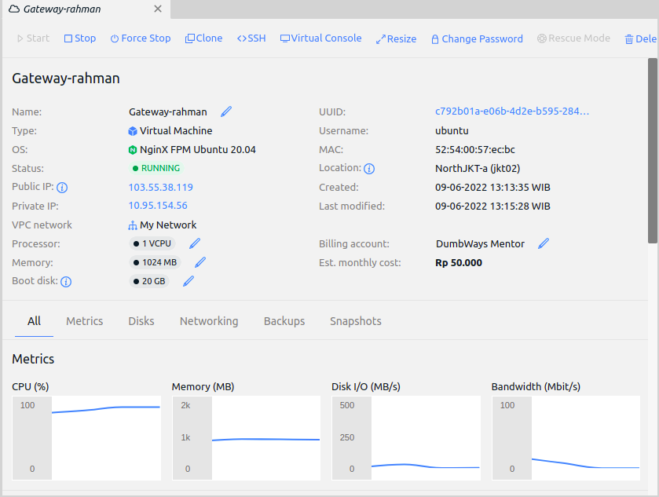

Kemudian saya juga mengubah DNS nya

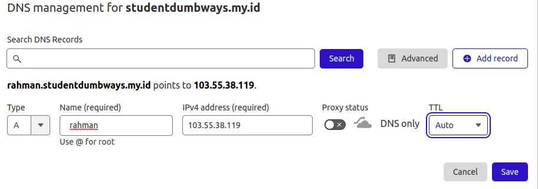

kemudian saya juga mengubah API tokennya 

`2312cc76618891ed4cb390af35876866b5a96`

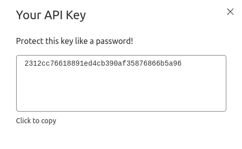

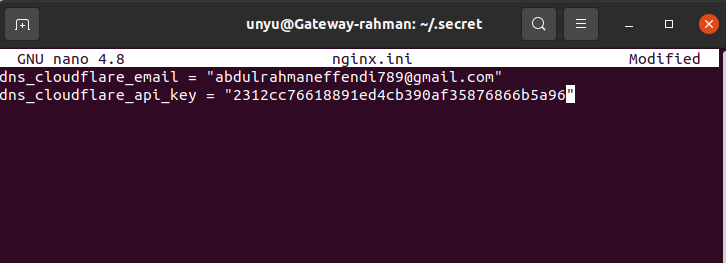

kemudian saya coba lagi untul instalasi certbot 

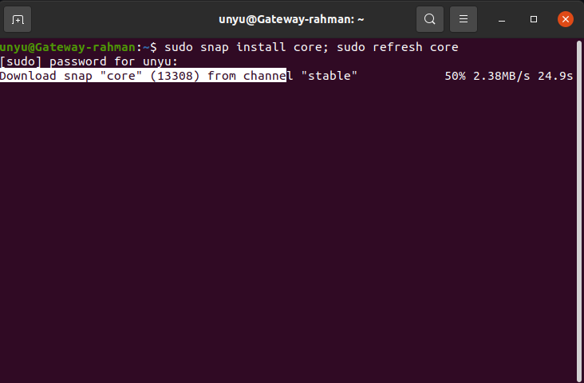

setelahnya masukan perintah :

```
sudo snap install --classic certbot
```

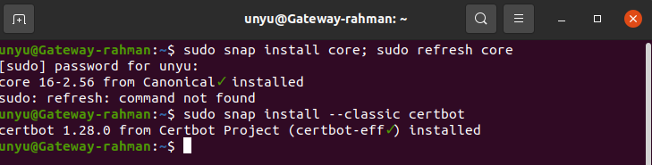

4. Kemudian Masukan perintah berikut agar certbet bisa di akses menggunakan coment 

```
sudo ln -s /snap/bin/certbot /usr/bin/certbot
```

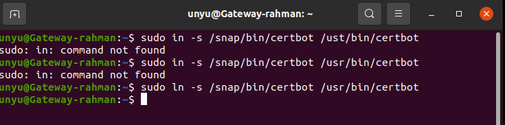

5. Jalankan certbot menggunakan perintah

```
sudo certbot 
```

pertama di minta email dari cloudflare 

kedua klik y untuk sertifikat nya 

ketiga optional kalau sertifikatnya mau expired, akan ada email berisikan pemberitahuan expired 

keempat masukan nama domain yang akan di gunakan 

kemudian Sukses

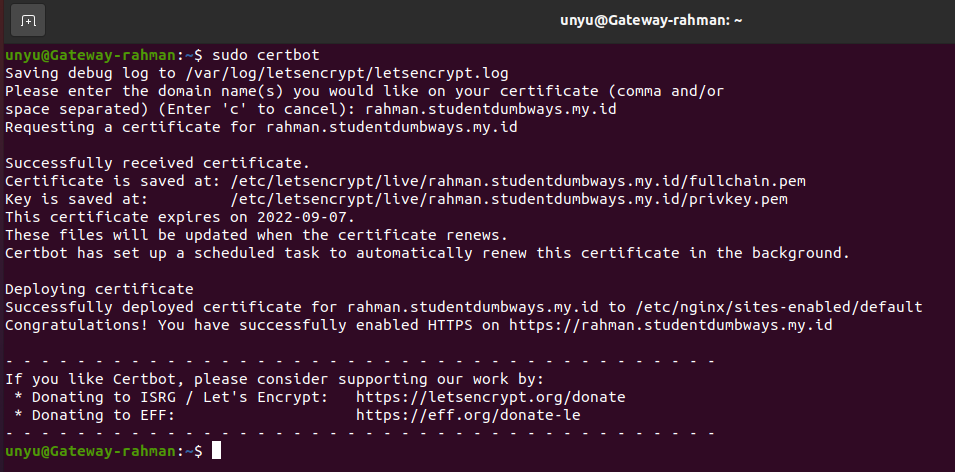

6. dan kita cek 

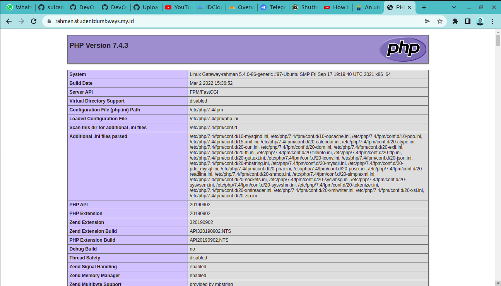

disini sepertinya ada yang salah, dan kesalahannya adalah belum membuat reverse proxy di server nginx baru unyu ini. 

7. Kemudian saya menambahkan proxy dan membuat sertifikat lagi 

disini saya menginstall ulang certifikatnya

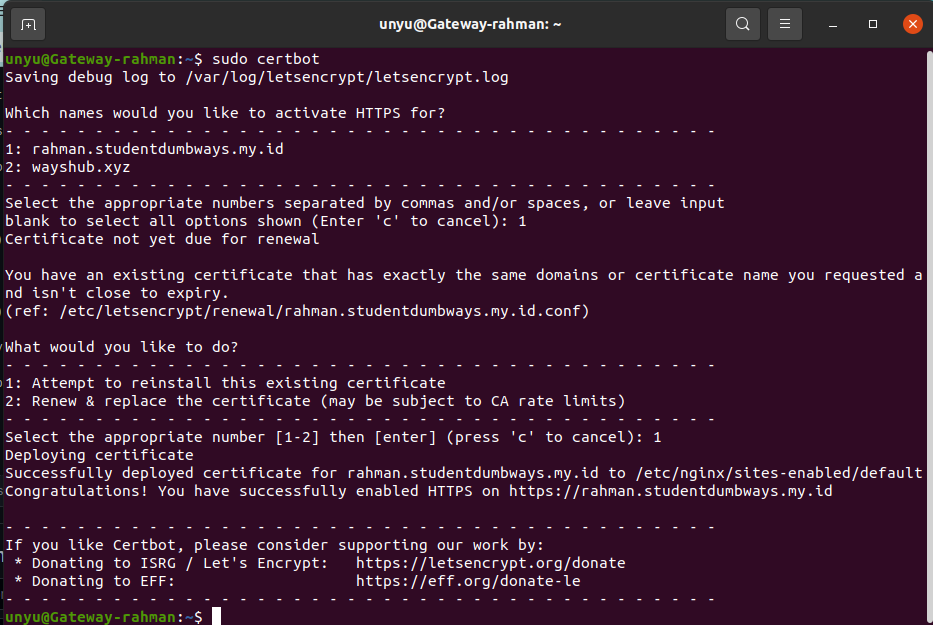

namun masih belum berubah

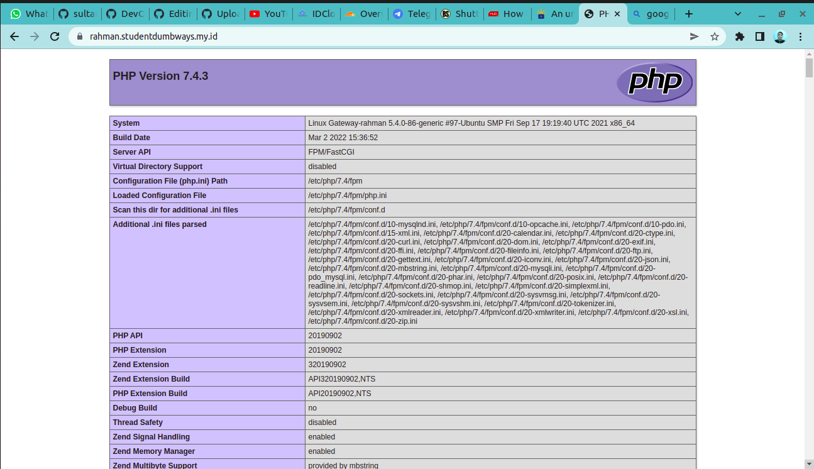

8. Kemudian saya coba untuk renew dan replace sertifikatnya 

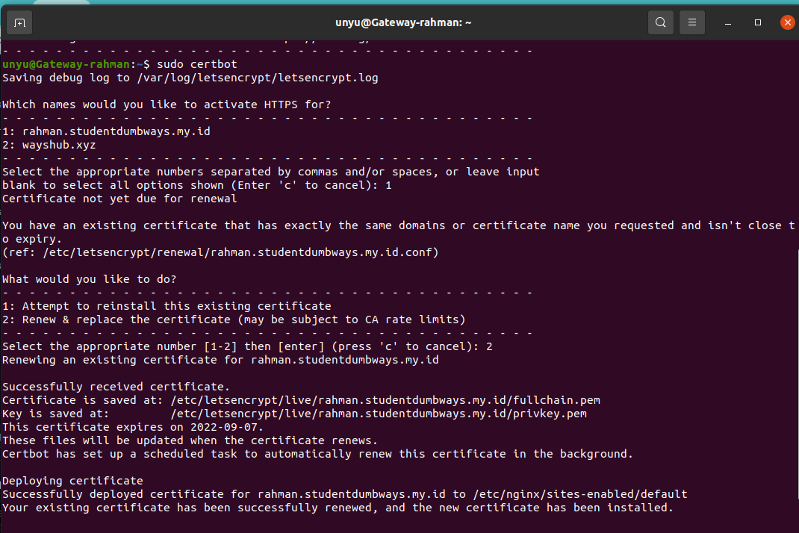

dan masih tetap sama

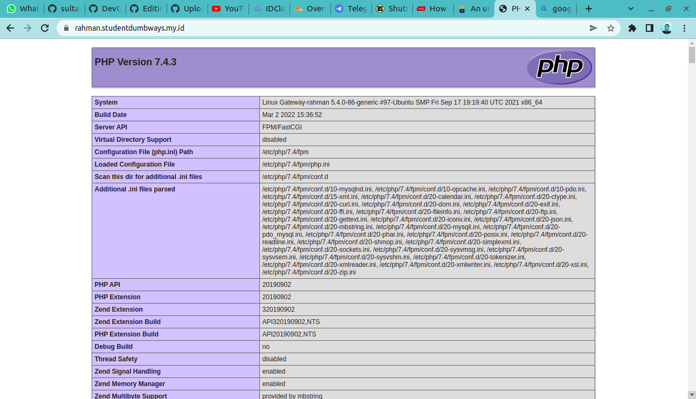


