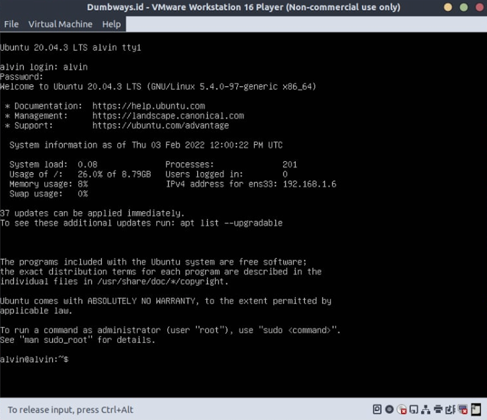

# Task :
CAUTION
Pastikan untuk melakukan screenshot step by step yang dilakukan, untuk digunakan sebagai dokumentasi tugas.

# 1. Instruksi

Setelah mempelajari terkait konfigurasi dan instalasi linux server, maka silakan buat sebuah environment linux dengan ketentuan sebagai berikut:

# VMware Environment
-Disk : 10 Gb

-Memory : 2 Gb

-Processors : 2 Cores

-Network : NAT

# Ubuntu Settings
Bahasa : English

Network : Static

Storage : Custom Storage Layout

Username : (your-user-name)

Password : (your-password)

Server Name : (your-name)

OpenSSH : True

# 2 Pengumpulan
Pastikan untuk mengerjakan tugas mingguan pada medium.com.

Tulis step-by-step yang telah Anda lakukan secara detail dan sertakan screenshot setiap prosesnya.

Setelah menyelesaikan tugas, silakan publish artikel yang sudah dibuat.
