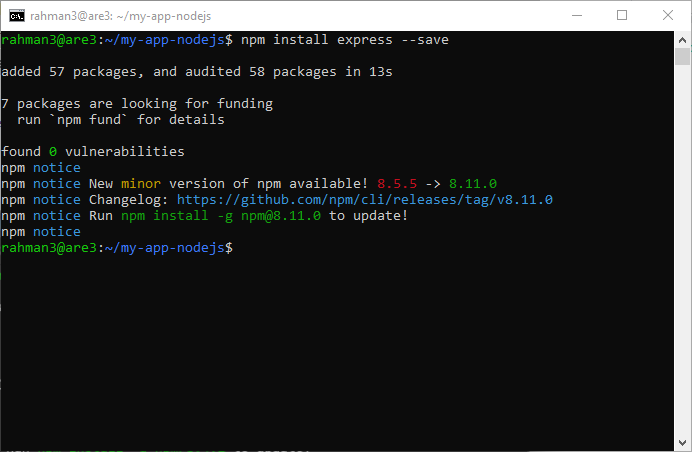
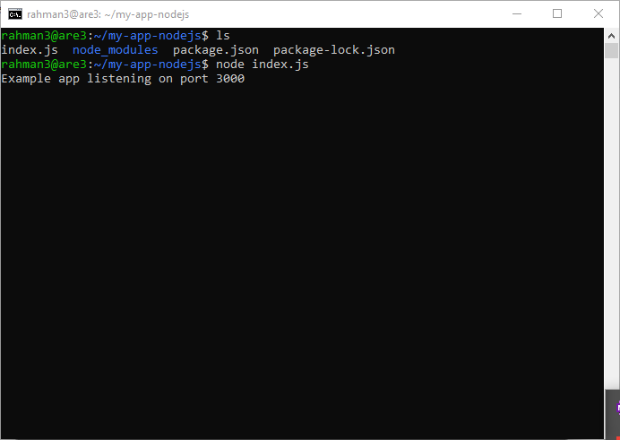

# Day 3
# Build dan Running aplikasi NodeJS, Golang dan Python3 dan Jalankan Secara Daemon Menggunakan PM2

Apa Itu Aplikasi ?


aplikasi merupakan suatu sub-class perangkat lunak yang menjalankan beberapa tugas dan fungsi untuk memudahkan user dalam suatu hal.


## Step 1 -  Instalasi, Build dan Run Aplikasi NodeJS

1. Install terlebih dahulu engine NodeJS dengan cara perintah berikut:
  
```
curl -o- https://raw.githubusercontent.com/nvm-sh/nvm/v0.38.0/install.sh | bash
```


keterangan : disini kita menggunakan nvm

nvm merupakan singkatan dari Node Version Manager. nvm adalah sebuah program yang akan membantu kita untuk menggunakan lebih dari satu versi Nodejs di dalam satu komputer.

```
exec bash
```

keterangan : Jika nvm belum terdeteksi gunakan perintah di atas ini

```
nvm install 16
```


keterangan : perintah di atas berguna untuk menginstall node.js dengan versi 16. Jika kalian ingin menggunakan node.js dengan version 14, maka Jalankan perintah nvm install 14.

```
nvm use 16  
```


keterangan : Untuk menggunakan node.js dengan versi 16

Jika tahapan di atas sudah kalian lakukan, maka kalian sudah berhasil untuk melakukan instalasi node.js. Untuk melakukan pengecekan kalian bisa menggunakan perintah di bawah ini.

```
node -v
```

```
npm -v
```


Selanjutnya buat direktori my-app-nodejs, kemudian kita akan menjalankan perintah npm init gunanya untuk menginisiasi project, Hasil dari kalian menjalankan perintah akan membuat file baru dengan nama package.json, package.json ini berisikan isi informasi dari aplikasi yang akan kalian buat.

```
npm init -y
```


Selanjutnya kita akan menginstall Express JS. Express JS adalah framework dari NodeJS yang dirancang secara fleksibel dan sederhana untuk membantu tahap pengembangan aplikasi back end. Menginstall express js dapat dilakukan menggunakan NPM dengan perintah berikut:

```
npm install express --save
```



Jika sudah buat file dengan nama index.js, lalu masukan script dibawah ini

```
nano index.js
```

```
const express = require("express");
const app = express();
const port = 3000;

app.get("/", (req, res) => {
  res.send("Hello World!");
});

app.listen(port, () => {
  console.log(`Example app listening on port ${port}`);
});
```


Jika sudah sekarang kita akan coba untuk menjalankan aplikasi sederhana yang sudah kita buat. Untuk menjalankan dapat menggunakan perintah berikut ini.

```
node index.js
```
 


Sekarang coba akses web browser kalian setelah itu kalian coba akses dengan localhost:3000


Selamat Praktek Nodejsnya Sudah Selesai


## Step 2 -  Instalasi, Build dan Run Aplikasi Golang

Pertama-tama sama seperti sebelumnya, Buat direktori baru untuk Golang dan kita harus mendownload engine-nya terlebih dahulu.

```
wget https://golang.org/dl/go1.16.5.linux-amd64.tar.gz && sudo su
```
kemudian masukan code server kamu sendiri, 

kemudian masukan script berikut ke nya

```
rm -rf /usr/local/go && tar -C /usr/local -xzf go1.16.5.linux-amd64.tar.gz && exit
```


Selanjutnya masukkan path go pada .bashrc

```
sudo nano .bashrc
```


```
export PATH=$PATH:/usr/local/go/bin
```


Jika sudah sekarang dapat verifikasi go dengan cara berikut.

```
go version
```

di karenakan setelah mengecek dengan go version masih tidak terinstall, kemudian sistem menyaran kan untuk install dengan perintah berikut 

```
sudo apt install golang-go
```

setelah itu , go version bisa di lakukan 


Sekarang kita akan membuat aplikasi sederhana menggunakan go. Kalian dapat menjalankan beberapa perintah berikut ini.

Buat sebuah file dengan nama index.go.

Setelah itu masukkan script dibawah ini di dalam file index.go

```
package main

import "fmt"

func main() {
    fmt.Println("Hello World!")
}
```


Sekarang jalankan aplikasi go dengan menggunakan perintah berikut.

```
go run index.go
```


Jika aplikasi kalian ingin di build, maka jalankan perintah berikut ini.

```
go build index.go
```


Jika sudah jalankan aplikasi dengan menggunakan perintah berikut.

```
./index
```


Selamat, Praktek Golang Sudah Selesai

# Step 3 - Instalasi, Build dan Run Aplikasi Python3

Aplikasi python telah di install secara default pada Ubuntu, maka kita tidak perlu mendownload nya lagi, untuk mengecek apakah python3 sudah ada gunakan perintah berikut:

```
python3 --version
```


Sekarang kita install package manager dari python3. Kalian dapat menggunakan perintah berikut ini.

```
sudo apt install python3-pip
```


```
pip install flask
```


PIP adalah sebuah package management system yang biasa digunakan untuk mengatur dan menginstall package yang berisi modul-modul Python. PIP digunakan untuk menginstall Flask karena Flask ditulis dan dikembangkan dengan bahasa dan modul-modul pemrograman Python. Dengan menggunakan PIP, semua hal yang dibutuhkan untuk instalasi Flask akan diunduh dan dipasang dalam satu perintah.

Sekarang kita akan membuat aplikasi sederhana menggunakan Python3.

Kalian buat terlebih dahulu file dengan nama index.py. Lalu masukan script dibawah ini.

```
nano index.py
```

didalamnya masukan script ini 

```
from flask import Flask
app = Flask(__name__)
@app.route("/")
def helloworld():
    return "Hello World"
if __name__ == "__main__":
    app.run() 
```    

Jika sudah sekarang jalankan aplikasi dengan menggunakan perintah berikut ini.

```
python3 index.py
```


# Step 4 - Menjalankan Aplikasi Secara Daemon Menggunakan PM2

Lakukan instalasi PM2 dengan perintah berikut:

```
npm install pm2 -g
```


Kemudian masuk ke directory NodeJS dan start aplikasi NodeJS kita secara daemon dengan perintah berikut:

```
pm2 start index.js
```


Dan aplikasi NodeJS kita berhasil dijalankan di PM2 secara daemon seperti gambar berikut:


Sekarang kita akan menjalankan aplikasi python kita dengan cara masuk terlebih dahulu ke directory python dan masukkan perintah berikut:

```
pm2 start index.py --interpreter python3
```

Dan aplikasi Python3 kita berhasil dijalankan di PM2 secara daemon seperti gambar berikut:


Sekarang kita akan masuk ke aplikasi Golang kita dan menjalankannya secara daemon dengan perintah berikut:

```
pm2 start index.go
```


Sekarang kita akan mengecek status keseluruhan dengan perintah berikut apakah berjalan dengan baik atau tidak

```
pm2 status
```


# Step 5 - Localtunnel

install localtunnel dengan perintah berikut

```
npm install -g localtunnel 
```

Untuk Aplikasi python disini menggunakan port 5000 dengan perintah:

```
lt --port 5000
```

Untuk Aplikasi NodeJS disini menggunakan port 3000 dengan perintah:

```
lt --port 3000
```


# DONE


